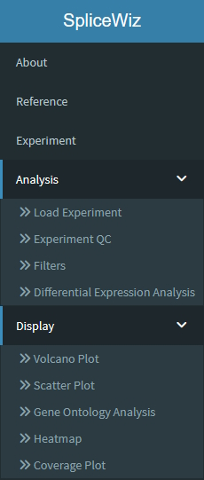
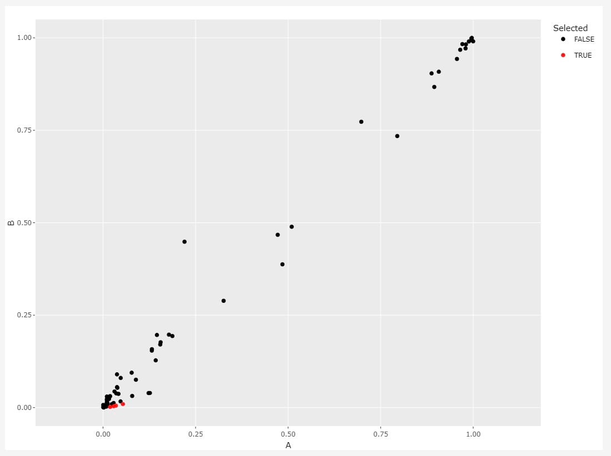

```{r, include = FALSE}
knitr::opts_chunk$set(
    collapse = TRUE,
    comment = "#>"
)
```
\

# Introduction

SpliceWiz is a graphical interface for differential alternative splicing and
visualization in R. It differs from other alternative splicing tools as it is
designed for users with basic bioinformatic skills to analyze datasets
containing up to hundreds of samples! SpliceWiz contains a number of innovations
including:

* Super-fast handling of alignment BAM files using ompBAM, our developer
resource for multi-threaded BAM processing,
* Alternative splicing event filters, designed to remove unreliable measurements
prior to differential analysis, which improves accuracy of reported results.
* Group-averaged coverage plots: publication-ready figures to clearly visualize
differential alternative splicing between biological / experimental conditions
* Seamless storage and recall of sequencing coverage, using the COV format that
stores strand-specific coverage typical of current RNA-seq protocols
* Interactive figures, including scatter and volcano plots, heatmaps, and
scrollable coverage plots, powered using the shinyDashboard interface

This vignette is a runnable working example of the SpliceWiz workflow. The
purpose is to quickly demonstrate the basic functionalities of SpliceWiz.

We provide here a brief outline of the workflow for users to get started as
quickly as possible. However, we also provide more details for those wishing
to know more. Many sections will contain extra information that can be
displayed when clicked on, such as these:

<details>
<summary>Click on me for more details</summary>
\
In most sections, we offer more details about each step of the workflow, that
can be revealed in text segments like this one. Be sure to click on  buttons 
like these, where available.
</details>
\

# What's New?

<details>
<summary>What's New: Novel splice detection (version 0.99.3+) </summary>
\
In version 0.99.3, SpliceWiz offers detection of novel events in addition to
annotated events. How this works:

* SpliceWiz compiles counts of all junctions (split reads) compatible with
splice junction events (having compatible donor / acceptor splice motifs)
* Additionally, it also uses "tandem junction" to identify novel exons
(tandem junctions are reads that are split into 3 or more segments, arising from
splicing of 2+ consecutive introns from a short-read sequence).

To reduce false positives in novel splicing detection, SpliceWiz provides 
several filters to reduce the number of novel junctions fed into the analysis:

* Novel junctions that are lowly expressed (only in a small number of samples)
are removed. The minimum number of samples required to retain a novel junction
is set using `novelSplicing_minSamples` parameter
* Alternately, junctions are retained if its expression exceeds a certain
threshold (set using `novelSplicing_countThreshold`) in a smaller number of
samples (set using `novelSplicing_minSamplesAboveThreshold`)
* Further, novel junctions can be filtered by requiring at least one end to be
an annotated splice site (this is enabled using 
`novelSplicing_requireOneAnnotatedSJ = TRUE`)

Novel ASE detection is integrated into the SpliceWiz pipeline at the collation
step. After compilation and processing of novel junctions / TJ's, the
novel transcripts are appended to the transcript annotation, which is then used
to re-construct the SpliceWiz reference. This reference is contained in the
"Reference" subfolder of the output folder of `collateData()` function.

**TL/DR - how to enable novel ASE mode**

* To enable analysis involving both annotated and novel ASEs, simply set
`novelSplicing = TRUE` when running `collateData()`. For example:

```{r, eval = FALSE}

# Usual pipeline:
ref_path <- file.path(tempdir(), "Reference")
buildRef(
    reference_path = ref_path,
    fasta = chrZ_genome(),
    gtf = chrZ_gtf()
)

pb_path <- file.path(tempdir(), "pb_output")
processBAM(
    bamfiles = bams$path,
    sample_names = bams$sample,
    reference_path = ref_path,
    output_path = pb_path
)

# Modified pipeline - collateData with novel ASE discovery:

nxtse_path <- file.path(tempdir(), "NxtSE_output")
collateData(
    Experiment = expr,
    reference_path = ref_path,
    output_path = nxtse_path,
    
        ## NEW ##
    novelSplicing = TRUE,
        # switches on novel splice detection
    
    novelSplicing_requireOneAnnotatedSJ = TRUE,
        # novel junctions must share one annotated splice site

    novelSplicing_minSamples = 3,
        # retain junctions observed in 3+ samples (of any non-zero expression)
    
    novelSplicing_minSamplesAboveThreshold = 1,
        # only 1 sample required if its junction count exceeds a set threshold
    novelSplicing_countThreshold = 10  
        # threshold for previous parameter
)
```

</details>
\

<details>
<summary>What's New: Visualising junction reads in coverage plots (version 0.99.4+)</summary>
\
In version 0.99.4, SpliceWiz visualises split/junction reads in individual
samples and in sample groups

For individual sample coverage plots (i.e. when `condition` is not set), 
junction counts for each sample are plotted. Samples with low junction counts
(less than 0.01x of the track height) are omitted to reduce clutter.

For group-normalized coverage plots (where coverage of multiple samples in a
condition group are combined), junctions are instead labeled by their
"provisional PSIs". These PSIs are calculated per junction (instead of per ASE).
This is done by determining the ratio of junction counts as a proportion of
all junction reads that share a common exon cluster as the junction being
assessed.

**TL/DR - how to enable junction plotting**

* To enable plotting of junctions, set `plotJunctions = TRUE` from within
`plotCoverage()`

```{r}
# Retrieve example NxtSE object
se <- SpliceWiz_example_NxtSE()

# Assign annotation of the experimental conditions
colData(se)$treatment <- rep(c("A", "B"), each = 3)

# Return a list of ggplot and plotly objects, also plotting junction counts
p <- plotCoverage(
    se = se,
    Event = "SE:SRSF3-203-exon4;SRSF3-202-int3",
    tracks = colnames(se)[1:4], 
    
        ## NEW ##
    plotJunctions = TRUE
)
```

```{r, fig.width = 8, fig.height = 6, eval = Sys.info()["sysname"] != "Darwin"}
if(interactive()) {
    # Display as plotly object
    p$final_plot
} else {
    # Display as ggplot
    as_ggplot_cov(p)
}
```

```{r}
# Plot by condition "treatment", including provisional PSIs
p <- plotCoverage(
    se = se,
    Event = "SE:SRSF3-203-exon4;SRSF3-202-int3",
    tracks = c("A", "B"), condition = "treatment", 

        ## NEW ##
    plotJunctions = TRUE
)

```

```{r, fig.width = 8, fig.height = 6, eval = Sys.info()["sysname"] != "Darwin"}
if(interactive()) {
    # Display as plotly object
    p$final_plot
} else {
    # Display as ggplot
    as_ggplot_cov(p)
}
```

</details>
\

# Workflow from a glance

The basic steps of SpliceWiz are as follows:

* Building the SpliceWiz reference
* Process BAM files using SpliceWiz
* Collate results of individual samples into an experiment
* Importing the collated experiment as an NxtSE object
* Alternative splicing event filtering
* Differential ASE analysis
* Visualization
\
\

# Quick-Start

## Installation

To install SpliceWiz, start R (version "4.2.1") and enter: 

```{r eval=FALSE}
if (!requireNamespace("BiocManager", quietly = TRUE))
    install.packages("BiocManager")

BiocManager::install("SpliceWiz")
```

<details>
<summary>Enabling OpenMP (multi-threading) for MacOS users (Optional)</summary>
\
For **MacOS** users, make sure OpenMP libraries are installed 
correctly. We recommend users follow this 
[guide](https://mac.r-project.org/openmp/), but the
quickest way to get started is to install `libomp` via brew:

```{bash eval=FALSE}
brew install libomp
```
</details> 
\

<details>
<summary>Installing statistical package dependencies (Optional)</summary>
\
SpliceWiz uses established statistical tools to perform alternative splicing
differential analysis:

* limma: models included and excluded counts as log-normal distributions
* DESeq2: models included and excluded counts as negative binomial distributions
* DoubleExpSeq: models included and excluded counts using beta binomial
distributions
* satuRn: models included and excluded counts using quasi-binomial 
distributions.

To install all of these packages:

```{r eval=FALSE}

install.packages("DoubleExpSeq")

if (!requireNamespace("BiocManager", quietly = TRUE))
    install.packages("BiocManager")

BiocManager::install(c("DESeq2", "limma", "satuRn"))
```
</details> 
\


## Loading SpliceWiz

```{r}
library(SpliceWiz)
```

<details>
<summary>Details</summary>
\
The SpliceWiz package loads the `NxtIRFdata` data package. This data package
contains the example "chrZ" genome / annotations and 6 example BAM files that
are used in this working example. Also, NxtIRFdata provides pre-generated
mappability exclusion annotations for building human and mouse SpliceWiz
references
</details> 
\

## The SpliceWiz Graphics User Interface (GUI)

SpliceWiz offers a graphical user interface (GUI) for interactive users, e.g.
in the RStudio environment. To start using SpliceWiz GUI:

```{r}
if(interactive()) {
    spliceWiz(demo = TRUE)
}
```
\
Note that the GUI demo mode is not supported on Bioconductor 3.13 or below.
\

### Navigating the GUI

The SpliceWiz GUI uses the `shinyDashboard` interface. Use the side menu on the
left hand side of the interface to navigate across the various sub-panels in the
SpliceWiz GUI.

```{r, echo=FALSE, out.width='231pt', fig.align = 'center', fig.cap="Menu Side Bar"}

```

## Building the SpliceWiz reference

<details>
<summary>Why do we need the SpliceWiz reference?</summary>
\
SpliceWiz first needs to generate a set of reference files. The SpliceWiz 
reference is used to quantitate alternative splicing in BAM files, 
as well as in downstream collation, differential analysis and visualisation.

SpliceWiz generates a reference from a user-provided genome FASTA and 
genome annotation GTF file, and is optimised for Ensembl references but can
accept other reference GTF files. Alternatively, SpliceWiz accepts AnnotationHub
resources, using the record names of AnnotationHub records as input.
</details> 
\

Using the example FASTA and GTF files, use the `buildRef()` function to build
the SpliceWiz reference:

```{r, results='hide', message = FALSE, warning = FALSE}
ref_path <- file.path(tempdir(), "Reference")
buildRef(
    reference_path = ref_path,
    fasta = chrZ_genome(),
    gtf = chrZ_gtf()
)
```

(NEW in version >= 0.99.3)
The SpliceWiz reference can be viewed as data frames using various getter
functions. For example, to view the annotated alternative splicing events (ASE):

```{r, results='hide', message = FALSE, warning = FALSE}
df <- viewASE(ref_path)

```

See `?View-Reference-methods` for a comprehensive list of getter functions

<details>
<summary>Using the GUI</summary>
\
After starting the SpliceWiz GUI in demo mode, 
click the `Reference` tab from the menu side bar. The following interface
will be shown:

```{r, echo=FALSE, out.width='800pt', fig.align = 'center', fig.cap="Reference GUI"}
knitr::include_graphics("img/buildRef.jpg")
```

(1) The first step to building a SpliceWiz reference is to select a directory in
which to create the reference. 

(2) SpliceWiz provides an interface to retrieve the genome sequence (FASTA) and transcriptome annotation (GTF) files from the Ensembl FTP server, by first selecting the "Release" and then "Species" from the drop-down boxes.

(3) Alternatively, users can provide their own FASTA and GTF files. 

(4) Human (hg38, hg19) and mouse genomes (mm10, mm9) have the option of
further refining IR analysis using built-in mappability exclusion annotations,
allowing SpliceWiz to ignore intronic regions of low mappability.

For now, to continue with the demo and create the reference using the GUI, 
click on the `Load Demo FASTA/GTF` (5), and then click `Build Reference` (6)
</details>
\

<details>
<summary>Where did the FASTA and GTF files come from?</summary>
\
The helper functions `chrZ_genome()` and `chrZ_gtf()` returns the paths to the 
example genome (FASTA) and transcriptome (GTF) file included with the 
`NxtIRFdata` package that contains the working example used by SpliceWiz:

```{r}
# Provides the path to the example genome:
chrZ_genome()

# Provides the path to the example gene annotation:
chrZ_gtf()
```
</details> 
\
<details>
<summary>What is the chrZ genome?</summary>
\
For the purpose of generating a running example to demonstrate SpliceWiz, we
created an artificial genome / gene annotation. This was created using 7 human 
genes (SRSF1, SRSF2, SRSF3, 
TRA2A, TRA2B, TP53 and NSUN5). The SRSF and TRA family of genes all contain
poison exons flanked by retained introns. Additionally, NSUN5 contains an
annotated IR event in its terminal intron. Sequences from these 7 genes were
aligned into one sequence to create an artificial chromosome Z (chrZ). The gene
annotations were modified to only contain the 7 genes with the modified genomic
coordinates.
</details>
\
<details>
<summary>What is Mappability and why should I care about it?</summary>
\
For the most part, the SpliceWiz reference can be built with just the FASTA and
GTF files. This is sufficient for assessment for most forms of alternative
splicing events.

For intron retention, accurate assessment of intron depth is important. However,
introns contain many repetitive regions that are difficult to map. We refer to
these regions as "mappability exclusions".

We adopt IRFinder's algorithm to identify these mappability exclusions. This is
determined empirically by generating synthetic reads systematically from the 
genome, then aligning these reads back to the same genome. Regions that contain
less than the expected coverage depth of reads define "mappability exclusions".

See the vignette: SpliceWiz cookbook for details on how to generate
"mappability exclusions" for any genome.\
</details>
\
<details>
<summary>How do I use pre-built mappability exclusions to generate human and
mouse references?</summary>
\
For human and mouse genomes, SpliceWiz provides pre-built mappability
exclusion references that can be used to build the SpliceWiz reference. 
SpliceWiz provides these annotations via the `NxtIRFdata` package.

Simply specify the genome in the parameter `genome_type` in the `buildRef()`
function (which accepts `hg38`, `hg19`, `mm10` and `mm9`).

Additionally, a reference for non-polyadenylated transcripts is used. This has
a minor role in QC of samples (to assess the adequacy of polyA capture).

For example, assuming your genome file `"genome.fa"` and a transcript annotation
`"transcripts.gtf"` are in the working directory, a SpliceWiz reference can be 
built using the built-in `hg38` low mappability regions and non-polyadenylated
transcripts as follows:

```{r eval = FALSE}
ref_path_hg38 <- "./Reference"
buildRef(
    reference_path = ref_path_hg38,
    fasta = "genome.fa",
    gtf = "transcripts.gtf",
    genome_type = "hg38"
)
```
</details>
\

## Process BAM files using SpliceWiz

The function `SpliceWiz_example_bams()` retrieves 6 example BAM files from
ExperimentHub and places a copy of these in the temporary directory.

```{r}
bams <- SpliceWiz_example_bams()
```

<details>
<summary>What are these example BAM files and how were they generated?</summary>
\
In this vignette, we provide 6 example BAM files. These were generated based on
aligned RNA-seq BAMs of 6 samples from the Leucegene AML dataset (GSE67039).
Sequences aligned to hg38 were filtered to only include genes aligned to that
used to create the chrZ chromosome. These sequences were then re-aligned to
the chrZ reference using STAR.\
</details>
\
<details>
<summary>How can I easily locate multiple BAM files?</summary>
\
Often, alignment pipelines process multiple samples. SpliceWiz provides 
convenience functions to recursively locate all the BAM files in a given folder,
and tries to ascertain sample names. Often sample names can be gleaned when:
* The BAM files are named by their sample names, e.g. "sample1.bam", 
"sample2.bam". In this case, `level = 0`
* The BAM files have generic names but are contained inside parent directories
labeled by their sample names, e.g. "sample1/Unsorted.bam", 
"sample2/Unsorted.bam". In this case, `level = 1`

```{r}
# as BAM file names denote their sample names
bams <- findBAMS(tempdir(), level = 0) 

# In the case where BAM files are labelled using sample names as parent 
# directory names (which oftens happens with the STAR aligner), use level = 1
```
</details>
\

Process these BAM files using SpliceWiz:

```{r, results='hide', message = FALSE, warning = FALSE}
pb_path <- file.path(tempdir(), "pb_output")
processBAM(
    bamfiles = bams$path,
    sample_names = bams$sample,
    reference_path = ref_path,
    output_path = pb_path
)
```
\
<details>
<summary>Using the GUI</summary>
\
After building the demo reference as shown in the previous section, start
SpliceWiz GUI in demo mode. Then, 
click the `Experiment` tab from the menu side bar. The following interface
will be shown:

```{r, echo=FALSE, out.width='8000pt', fig.align = 'center', fig.cap="Experiment GUI"}

```

Click on (2) `Define Project Folders` to bring up the following drop-down
box:
```{r, echo=FALSE, out.width='480pt', fig.align = 'center', fig.cap="Define Project Folders"}

```

We need to define the folders that contain our reference, BAM files, as well
as processBAM output files and the final compiled experiment (that generates
the NxtSE object).

* Click on (1) `Choose Folder (Reference)` and select the `Reference` directory
(where the SpliceWiz reference was generated by the previous step. Then,
* Click on (2) `Choose Folder (BAM files)` and select the `bams` directory
(where the demo BAM files have been generated). 
* Click on (3) `Choose Folder (processBAM output)` and select the `pb_output` 
directory (which should currently be empty). 
* Finally, click on (4) `Choose Folder (NxtSE files)` and select the `NxtSE` 
directory(which should currently be empty). 

After our folders have been defined, on the right hand side, an interactive
table should be displayed that looks like the following:

```{r, echo=FALSE, out.width='640pt', fig.align = 'center', fig.cap="Running processBAM"}

```

To run processBAM on the example BAM files, first drag to select the 6 cells
containing the BAM file paths (as shown). Next, click the `Process BAM files`
to open the dropdown menu, and then click `Run processBAM()`. A prompt should
then be displayed asking whether you wish to proceed. Click `OK` to start
running processBAM.
</details>
\

<details>
<summary>What is the `processBAM()` function</summary>
\
SpliceWiz's `processBAM()` function can process one or more BAM files. This
function is ultra-fast, relying on an internal native C++ function that uses
OpenMP multi-threading (via the `ompBAM` C++ API). 

Input BAM files can be either read-name sorted or coordinate sorted (although
SpliceWiz prefers the former). Indexing of coordinate-sorted BAMs are not
necessary.

`processBAM()` loads the SpliceWiz reference. Then, it reads each BAM file in
their entirety, and quantifies the following:

* Basic QC parameters including number of reads, directionality, etc
* Counts of gapped (junction) reads / fragments
* Intron coverage depths and other parameters (identical output to IRFinder)
* COV files (which are like BigWig files but record strand-specific coverage)
* Miscellaneous quants including coverage of chromosomes, intergenic regions,
rRNAs, and non-polyadenylated regions

For each BAM file, `processBAM()` generates two output files. The first is a
gzipped text file containing all the quantitation data. The second is a `COV`
file which contains the per-nucleotide RNA-seq coverage of the sample.\
</details>
\
<details>
<summary>More details on the `processBAM()` function</summary>
\
At minimum, `processBAM()` requires four parameters:

* `bamfiles` : The paths of the BAM files
* `sample_names` : The sample names corresponding to the given BAM files
* `reference_path` : The directory containing the SpliceWiz reference
* `output_path` : The directory where the output of `processBAM()` should go

```{r, results='hide', message = FALSE, warning = FALSE}
pb_path <- file.path(tempdir(), "pb_output")
processBAM(
    bamfiles = bams$path,
    sample_names = bams$sample,
    reference_path = ref_path,
    output_path = pb_path
)
```

`processBAM()` also takes several optional, but useful, parameters:

* `n_threads` : The number of threads for multi-threading
* `overwrite` : Whether existing files in the output directory should be
overwritten
* `run_featureCounts` : (Requires the Rsubread package) runs featureCounts to
obtain gene counts (which outputs results as an RDS file)

For example, to run `processBAM()` using 2 threads, disallow overwrite of
existing `processBAM()` outputs, and run featureCounts afterwards, one would
run the following:

```{r, eval = FALSE}
# NOT RUN

# Re-run IRFinder without overwrite, and run featureCounts
require(Rsubread)

processBAM(
    bamfiles = bams$path,
    sample_names = bams$sample,
    reference_path = ref_path,
    output_path = pb_path,
    n_threads = 2,
    overwrite = FALSE,
    run_featureCounts = TRUE
)

# Load gene counts
gene_counts <- readRDS(file.path(pb_path, "main.FC.Rds"))

# Access gene counts:
gene_counts$counts
```
</details>
\

## Collate the experiment

The helper function `findSpliceWizOutput()` organises the output files of
SpliceWiz's `processBAM()` function. It identifies matching `"txt.gz"` and 
`"cov"` files for each sample, and organises these file paths conveniently
into a 3-column data frame:

```{r}
expr <- findSpliceWizOutput(pb_path)
```

Using this data frame, collate the experiment using `collateData()`. We name
the output directory as `NxtSE_output` as this folder will contain the data
needed to import the NxtSE object:

```{r, results='hide', message = FALSE, warning = FALSE}
nxtse_path <- file.path(tempdir(), "NxtSE_output")
collateData(
    Experiment = expr,
    reference_path = ref_path,
    output_path = nxtse_path
)
```
\
<details>
<summary>What is the `collateData()` function</summary>
\
`collateData()` combines the `processBAM()` output files of multiple samples and
builds a single database. `collateData()` creates a number of files in the
chosen output directory. These outputs can then be imported into the R session
as a `NxtSE` data object for downstream analysis.

At minimum, `collateData()` takes the following parameters:

* `Experiment` : The 2- or 3- column data frame. The first column should contain
(unique) sample names. The second and (optional) third columns contain the 
`"txt.gz"` and `"cov"` file paths
* `reference_path` : The directory containing the SpliceWiz reference
* `output_path` : The directory where the output of `processBAM()` should go

`collateData()` can take some optional parameters:

* `IRMode` : Whether to use SpliceWiz's `SpliceOver` method, or IRFinder's 
`SpliceMax` method, to determine total spliced transcript abundance. Briefly,
`SpliceMax` considers junction reads that have either flanking splice site
coordinate. `SpliceOver` considers additional junction reads that splices
across exon clusters in common. Exon clusters are groups of mutually-overlapping
exons. `SpliceOver` is the default option.
* `overwrite` : Whether files in the output directory should be overwritten
* `n_threads` : Use multi-threaded operations where possible
* `lowMemoryMode` : Minimise memory usage where possible. Note that most of the
collateData pipeline will be single-threaded if this is set to `TRUE`.

`collateData()` is a memory-intensive operation when run using multiple threads.
We estimate it can use up to 6-7 Gb per thread. `lowMemoryMode` will minimise
RAM usage to ~ 8 Gb, but will be slower and run on a single thread.\
</details>

\
<details>
<summary>Enabling novel splicing detection</summary>
\
Novel splicing detection can be switched on by setting `novelSplicing = TRUE`
from within the `collateData()` function:

```{r, results='hide', message = FALSE, warning = FALSE}
# Modified pipeline - collateData with novel ASE discovery:

nxtse_path <- file.path(tempdir(), "NxtSE_output_novel")
collateData(
    Experiment = expr,
    reference_path = ref_path,
    output_path = nxtse_path,
    novelSplicing = TRUE     ## NEW ##
)
```

`collateData()` uses split reads that are not annotated introns to help 
construct hypothetical minimal transcripts. These are then injected into the
original transcriptome annotation (GTF) file, whereby the SpliceWiz reference
is rebuilt. The new SpliceWiz reference (which contains these novel transcripts)
is then used to collate the samples.

To reduce false positives in novel splicing detection, SpliceWiz provides 
several filters to reduce the number of novel junctions fed into the analysis:

* Novel junctions that are lowly expressed (only in a small number of samples)
are removed. The minimum number of samples required to retain a novel junction
is set using `novelSplicing_minSamples` parameter
* Alternately, junctions are retained if its expression exceeds a certain
threshold (set using `novelSplicing_countThreshold`) in a smaller number of
samples (set using `novelSplicing_minSamplesAboveThreshold`)
* Further, novel junctions can be filtered by requiring at least one end to be
an annotated splice site (this is enabled using 
`novelSplicing_requireOneAnnotatedSJ = TRUE`).

For example, if one wished to retain novel reads seen in 3 or more samples, or
novel spliced reads with 10 or more counts in at least 1 sample, and requiring
at least one end of a novel junction being an annotated splice site:

```{r eval = FALSE}
nxtse_path <- file.path(tempdir(), "NxtSE_output_novel")
collateData(
    Experiment = expr,
    reference_path = ref_path,
    output_path = nxtse_path,
    
        ## NEW ##
    novelSplicing = TRUE,
        # switches on novel splice detection
    
    novelSplicing_requireOneAnnotatedSJ = TRUE,
        # novel junctions must share one annotated splice site

    novelSplicing_minSamples = 3,
        # retain junctions observed in 3+ samples (of any non-zero expression)
    
    novelSplicing_minSamplesAboveThreshold = 1,
        # only 1 sample required if its junction count exceeds a set threshold
    novelSplicing_countThreshold = 10  
        # threshold for previous parameter
)
```

</details>

\
<details>
<summary>Using the GUI</summary>
\
After running the Reference and processBAM steps as indicated in the previous
sections (of the GUI instructions), click `Construct Experiment`.
Your interface should now look like this:

```{r, echo=FALSE, out.width='800pt', fig.align = 'center', fig.cap="collateData GUI"}
knitr::include_graphics("img/Expr_cd.jpg")
```

This drop-down dialog box contains several parameters related to novel splicing
detection:

(1) Toggle on/off novel splice detection
(2) Restrict novel junction reads to having one annotated splice site
(3) Filter novel junction counts based on any expression 
(min number of samples set here)
(4) Filter novel junction counts based on expression threshold 
(min number of samples set here)
(5) Threshold split read count (expression threshold based novel junction 
filter)

To collate the experiment, click on (6) `Run collateData()`. 
An alert pop-up should be displayed when this process is complete.

To clear all the setting on the Experiment page, click (7).
</details>
\

## Importing the experiment

Before differential analysis can be performed, the collated experiment must be
imported into the R session as an `NxtSE` data object.

After running `collateData()`, import the experiment using the 
`makeSE()` function:

```{r, results='hide', message = FALSE, warning = FALSE}
se <- makeSE(nxtse_path)
```
\
<details>
<summary>Using the GUI</summary>
\
After running the steps in the previous GUI sections, navigate to `Analysis`
and then click the `Load Experiment` on the menu bar. The display should
look like this:

```{r, echo=FALSE, out.width='480pt', fig.align = 'center', fig.cap="Loading the NxtSE GUI"}
knitr::include_graphics("img/Expr_load_empty.jpg")
```

First, click the `Open Folder containing NxtSE` to open the dropdown, then 
click `Choose Folder (NxtSE)`. Select the `NxtSE` directory. The interface
should now look like this:

```{r, echo=FALSE, out.width='800pt', fig.align = 'center', fig.cap="Loading the NxtSE GUI"}
knitr::include_graphics("img/Expr_load_folder.jpg")
```

To load the NxtSE object, click the `Load NxtSE object` to open the dropdown,
then click `Load NxtSE object` to load the NxtSE object into the current 
session.

</details>
\
<details>
<summary>What is the `makeSE()` function</summary>
\
The `makeSE()` function imports the compiled data generated by the 
`collateData()` function. Data is imported as an `NxtSE` object. Downstream
analysis, including differential analysis and visualization, is performed using
the `NxtSE` object.
\
</details>
\
<details>
<summary>More details about the `makeSE()` function</summary>
\
By default, `makeSE()` uses delayed operations to avoid consuming memory
until the data is actually needed. This is advantageous in analysis of hundreds
of samples on a computer with limited resources. However, it will be slower. To
load all the data into memory, we need to "realize" the NxtSE object, as
follows:

```{r}
se <- realize_NxtSE(se)
```

Alternatively, `makeSE()` can realize the NxtSE object at construction:

```{r eval = FALSE}
se <- makeSE(nxtse_path, realize = TRUE)
```

By default, `makeSE()` constructs the NxtSE object using all the samples in
the collated data. It is possible (and particularly useful in large data sets)
to read only a subset of samples. In this case, construct a data frame object
with the first column containing the desired sample names and parse this into
the `colData` parameter as shown:

```{r, eval = FALSE}
subset_samples <- colnames(se)[1:4]
df <- data.frame(sample = subset_samples)
se_small <- makeSE(nxtse_path, colData = df, RemoveOverlapping = TRUE)
```

In complex transcriptomes including those of human and mouse, alternative
splicing implies that introns are often overlapping. Thus, algorithms run the
risk of over-calling intron retention where overlapping introns are assessed.
SpliceWiz removes overlapping introns by considering only introns belonging to
the major splice isoforms. It estimates a list of introns of major isoforms
by assessing the compatible splice junctions of each isoform, and removes
overlapping introns belonging to minor isoforms. To disable this functionality,
set `RemoveOverlapping = FALSE`.
\
</details>
\

## Differential analysis

### Assigning annotations to samples

```{r}
colData(se)$condition <- rep(c("A", "B"), each = 3)
colData(se)$batch <- rep(c("K", "L", "M"), 2)
```
\
<details>
<summary>Using the GUI</summary>
\
After following the previous GUI sections, with the NxtSE loaded, click on
`Review Annotations`. Then, click `Edit Interactively`. Your interface should
now look like this:

```{r, echo=FALSE, out.width='800pt', fig.align = 'center', fig.cap="NxtSE Annotations GUI"}
knitr::include_graphics("img/Expr_anno_empty.jpg")
```

Now, lets add an extra column. In the `Annotation Columns` box which has just
appeared, type in a name `condition`, then click `Add`. Then, click `batch`
and again click `Add`. Then, click on each empty cell and fill in the fields
as shown:

```{r, echo=FALSE, out.width='800pt', fig.align = 'center', fig.cap="NxtSE Annotations GUI"}
knitr::include_graphics("img/Expr_anno_filled.jpg")
```

Finally, the annotated NxtSE needs to be reloaded into memory. Click
`Load NxtSE object` and then `Load NxtSE object` to reload the NxtSE object
with the new annotations.

NB: Annotations can be assigned prior to loading the NxtSE object, but can only
be done after the NxtSE folder is selected.

Alternatively, users can provide a file that contains the annotations in tabular
format (e.g. a comma-separated values (CSV) or tab-separated values (TSV) file).
Click on `Review Annotations` and then `Import Data Frame from File`. Then,
select the `demo_annotations.csv` file that has been pre-generated by 
SpliceWiz's demo mode. 
</details>
\
<details>
<summary>Saving and reloading the NxtSE as an RDS file (GUI)</summary>
\
Once an NxtSE object has been loaded into memory, you can save it as an RDS
object so it can be reloaded in a later session. To do this, click the
`Save NxtSE to/from RDS file`, then click `Save NxtSE as RDS`. Choose a file
name and location and press `OK`. This RDS file can be loaded as an NxtSE
object in a later GUI session by clicking the `Load NxtSE from RDS` button.

</details>
\

<details>
<summary>What is the `NxtSE` object</summary>
\
`NxtSE` is a data object which contains all the required data for downstream
analysis after all the BAM alignment files have been process and the experiment
is collated.

```{r}
se
```

The `NxtSE` object inherits the `SummarizedExperiment` object. This means that
the functions for SummarizedExperiment can be used on the NxtSE object. These
include row and column annotations using the `rowData()` and `colData()`
accessors.

Rows in the `NxtSE` object contain information about each alternate splicing 
event. For example:

```{r}
head(rowData(se))
```

Columns contain information about each sample. By default, no annotations are
assigned to each sample. These can be assigned as shown above.

Also, `NxtSE` objects can be subsetted by rows (ASEs) or columns (samples). This
is useful if one wishes to perform analysis on a subset of the dataset, or only
on a subset of ASEs (say for example, only skipped exon events). Subsetting is
performed just like for `SummarizedExperiment` objects:

```{r}
# Subset by columns: select the first 2 samples
se_sample_subset <- se[,1:2]

# Subset by rows: select the first 10 ASE events
se_ASE_subset <- se[1:10,]
```
\
</details>
\

### Filtering high-confidence events

SpliceWiz offers default filters to identify and remove low confidence
alternative splice events (ASEs). Run the default filter using the following:

```{r}
se.filtered <- se[applyFilters(se),]
```
\
<details>
<summary>Using the GUI</summary>
\
After following the GUI tutorials in the prior sections, click on `Analysis`
and then `Filters` from the menu bar. It should look like this:

```{r, echo=FALSE, out.width='800pt', fig.align = 'center', fig.cap="Filters - GUI"}

```

To load SpliceWiz's default filters, click the top right button 
`Load Default Filters`. Then to apply these filters to the NxtSE, click 
`Apply Filters`. After the filters have been run, your session should now look
like this:

```{r, echo=FALSE, out.width='800pt', fig.align = 'center', fig.cap="SpliceWiz default filters- GUI"}
knitr::include_graphics("img/Filters_applied.jpg")
```
</details>
\

<details>
<summary>Why do we need to filter alternative splicing events?</summary>
\
Often, the gene annotations contain isoforms for all discovered splicing events.
Most annotated transcripts are not expressed, and their inclusion in 
differential analysis complicates results including adjusting for multiple 
testing. It is prudent to filter these out using various approaches, akin to 
removing genes with low gene counts in differential gene analysis. We suggest
using the default filters which work well for small experiments with sequencing
depths at 100-million paired-end reads.

To learn more about filters, consult the documentation via `?ASEFilters`
</details>
\

### Performing differential analysis

Using the limma wrapper `ASE_limma()`, perform differential ASE analysis between
conditions "A" and "B":

```{r, results='hide', message = FALSE, warning = FALSE}
# Requires limma to be installed:
require("limma")
res_limma <- ASE_limma(
    se = se.filtered,
    test_factor = "condition",
    test_nom = "B",
    test_denom = "A",
)
```

<details>
<summary>Using the GUI</summary>
\
After running the previous sections (of the GUI instructions), click `Analysis`
and then `Differential Expression Analysis` on the menu side bar. It should look
something like this (but with empty fields):

```{r, echo=FALSE, out.width='800pt', fig.align = 'center', fig.cap="Differential Expression GUI"}
knitr::include_graphics("img/DE_empty.jpg")
```

To perform limma-based differential analysis, first ensure `Method` is set to
`limma`. Using the `Variable` drop-down box, select `condition`. Then, select
the `Nominator` and `Denominator` fields to `A` and `B`, respectively. Leave
the batch factor fields as `(none)`. Then, click `Perform DE`.

Once differential expression analysis has finished, your session should look
like below. The output is a DT-based data table equivalent to the `ASE_limma()`
function.

```{r, echo=FALSE, out.width='800pt', fig.align = 'center', fig.cap="Differential Expression (limma) GUI"}
knitr::include_graphics("img/DE_limma.jpg")
```

NB: The interface allows users to choose to sort the results either by nominal
or (multiple-testing) adjusted P values

NB2: There are 3 different ways Intron Retention events can be quantified and
analysed - see "What are the different ways intron retention is measured?" below
for further details.

</details>
\

<details>
<summary>What are the options for differential ASE analysis?</summary>
\
SpliceWiz provides wrappers to three established algorithms:

* `ASE_limma` uses `limma` to model isoform counts as log-normal distributions.
Limma is probably the fastest method and is ideal for large datasets
* `ASE_DESeq` uses `DESeq2` to model isoform counts as negative binomial
distribution. This method is the most computationally expensive, but gives
robust results. Time series analysis is also available for this mode
* `ASE_DoubleExpSeq` uses the lesser-known CRAN package `DoubleExpSeq`. This
package uses the beta-binomial distribution to model isoform counts. The method
is at least as fast as `limma`, but for now it is restricted to analysis
between two groups (i.e. batch correction is not implemented)
* (New in 0.99.4+) `ASE_satuRn` uses the new `satuRn` package which models 
counts using the quasi-binomial distribution.

```{r, results='hide', message = FALSE, warning = FALSE}
# Requires limma to be installed:
require("limma")
res_limma <- ASE_limma(
    se = se.filtered,
    test_factor = "condition",
    test_nom = "B",
    test_denom = "A"
)

# Requires DESeq2 to be installed:
require("DESeq2")
res_deseq <- ASE_DESeq(
    se = se.filtered,
    test_factor = "condition",
    test_nom = "B",
    test_denom = "A",
    n_threads = 1
)

# Requires DoubleExpSeq to be installed:
require("DoubleExpSeq")
res_DES <- ASE_DoubleExpSeq(
    se = se.filtered,
    test_factor = "condition",
    test_nom = "B",
    test_denom = "A"
)

# Requires satuRn to be installed:
require("satuRn")
res_saturn <- ASE_satuRn(
    se = se.filtered,
    test_factor = "condition",
    test_nom = "B",
    test_denom = "A",
    n_threads = 1
)
```
\
</details>
\
<details>
<summary>What are the different ways intron retention is measured?</summary>
\
Intron retention can be measured via two approaches.

The first (and preferred) approach is using IR-ratio. We presume that every
intron is potentially retained (thus ignoring annotation). Given this results in
many overlapping introns, SpliceWiz adjusts for this via the following:

* Where there are mutually-overlapping introns, the less abundant intron is
removed from the analysis. Abundance is estimated across the entire dataset, and
less-abundant overlapping introns are removed at the `makeSE()` step.
* IR-ratio measures included (intronic) abundance using an identical approach
to IRFinder, i.e., it calculates the trimmed mean of sequencing depth across the
intron, excluding annotated outliers (other exons, intronic elements). Given we
cannot assume whether the exact intron corresponds to the major isoform, we
estimate splicing abundance by summing junction reads that share either exon
cluster as the intron of interest (`SpliceOver` method in SpliceWiz). 
Alternately, users can choose to use IRFinder's `SpliceMax` method, summing
junction reads that share either splice junction with the intron of interest.
This choice is also made by the user at the `makeSE()` step.

At the differential analysis step, users can choose the following:

* `IRmode = "all"` - all introns are potentially retained, use IR-ratio to 
quantify IR (`EventType = "IR"`)
* `IRmode = "annotated"` - only annotated retained intron events are considered,
but use IR-ratio to quantify IR (`EventType = "IR"`)
* `IRmode = "annotated_binary"` - only annotated retained intron events are
considered, use PSI to quantify IR - which considers the IR-transcript and
the transcript isoform with the exactly-spliced intron as binary alternatives.
Splicing of overlapping introns are not considered in PSI quantitation.


```{r, results='hide', message = FALSE, warning = FALSE}
res_limma_allIntrons <- ASE_limma(
    se = se.filtered,
    test_factor = "condition",
    test_nom = "B",
    test_denom = "A",
    IRmode = "all"
)

res_limma_annotatedIR <- ASE_limma(
    se = se.filtered,
    test_factor = "condition",
    test_nom = "B",
    test_denom = "A",
    IRmode = "annotated"
)

res_limma_annotated_binaryIR <- ASE_limma(
    se = se.filtered,
    test_factor = "condition",
    test_nom = "B",
    test_denom = "A",
    IRmode = "annotated_binary"
)
```
\
<\details>
\

<details>
<summary>Can I account for batch factors?</summary>
\
`ASE_limma`, `ASE_DESeq` and `ASE_satuRn` can accept up to 2 categories of 
batches from which to normalize. For example, to normalize the analysis by the 
`batch` category, one would run:

```{r, results='hide', message = FALSE, warning = FALSE}
require("limma")
res_limma_batchnorm <- ASE_limma(
    se = se.filtered,
    test_factor = "condition",
    test_nom = "B",
    test_denom = "A",
    batch1 = "batch"
)
```
\
</details>
\
<details>
<summary>Can I do time series analysis?</summary>
\
Time series analysis can be performed only using DESeq2 (for now). To do this,
simply do not specify the `test_nom` and `test_denom` parameters. As long as
the `test_factor` contains numeric values, `ASE_DESeq` will treat it as a
continuous variable. See the following example:

```{r, results='hide', message = FALSE, warning = FALSE}
colData(se.filtered)$timevar <- rep(c(0,1,2), 2)

require("DESeq2")
res_deseq_cont <- ASE_DESeq(
    se = se.filtered,
    test_factor = "timevar"
)
```
\
<\details>
\

## Visualization

### Volcano plots

Volcano plots show changes in PSI levels (log fold change, x axis) against
statistical significance (-log10 p values, y axis):

```{r, fig.width = 7, fig.height = 5, eval = Sys.info()["sysname"] != "Darwin"}
library(ggplot2)

ggplot(res_limma,
        aes(x = logFC, y = -log10(adj.P.Val))) + 
    geom_point() +
    labs(title = "Differential analysis - B vs A",
         x = "Log2-fold change", y = "BH-adjusted P values (-log10)")
```

<details>
<summary>Can I visualize significant events for each modality of
alternative splicing events?</summary>
\
Yes. We can use `ggplot2`'s `facet_wrap` function to separately plot volcanos
for each modality of ASE. The type of ASE is contained in the `EventType` column
of the differential results data frame.

```{r, fig.width = 7, fig.height = 5, eval = Sys.info()["sysname"] != "Darwin"}
ggplot(res_limma,
        aes(x = logFC, y = -log10(adj.P.Val))) + 
    geom_point() + facet_wrap(vars(EventType)) +
    labs(title = "Differential analysis - B vs A",
         x = "Log2-fold change", y = "BH-adjusted P values (-log10)")
```
\
</details>
\
<details>
<summary>Using the GUI</summary>
\
After following the previous sections including differential analysis, navigate
to `Display` and then `Volcano Plot`. The default volcano plot (top 1000 ASEs)
will be automatically generated as a plotly object:

```{r, echo=FALSE, out.width='800pt', fig.align = 'center', fig.cap="Volcano Plot - GUI"}

```

You can customize this volcano plot using the following controls:

* (1) Adjust the number of top events. Differential ASEs are ranked either by
adjusted or nominal p-values depending on the `Sort by Adjusted P Values` in the
differential analysis interface.
* (2) Select one or more `Splice Type`s. The volcano plot will be filtered by
the selected ASE modalities
* (3) You can facet the volcano plot to show separate volcano plots for each
modality
* (4) Instead of nominal p values, Benjamini Hochberg adjusted p values are 
shown if this is `ON`.
* (5) If `NMD Mode` is `ON`, the horizontal axis represents whether splicing
is shifted towards (positive values) or away from (negative values) a NMD
substrate transcript
* (6) Clear settings

</details>
\

### Scatter plots

Scatter plots are useful for showing splicing levels (percent-spliced-in, PSI)
between two conditions. The results from differential analysis contains these
values and can be plotted:

```{r, fig.width = 7, fig.height = 5, eval = Sys.info()["sysname"] != "Darwin"}
library(ggplot2)

ggplot(res_limma, aes(x = 100 * AvgPSI_B, y = 100 * AvgPSI_A)) + 
    geom_point() + xlim(0, 100) + ylim(0, 100) +
    labs(title = "PSI values across conditions",
         x = "PSI of condition B", y = "PSI of condition A")
```

<details>
<summary>Using the GUI</summary>
\
After following the previous sections including differential analysis, navigate
to `Display` and then `Scatter Plot`.

You can customize the scatter plot using the following controls:

* (1) Adjust the number of top events. Differential ASEs are ranked either by
adjusted or nominal p-values depending on the `Sort by Adjusted P Values` in the
differential analysis interface.
* (2) Select one or more `Splice Type`s. The scatter plot will be filtered by
the selected ASE modalities
* (3) `Variable` refers to the annotation category
* (4) and (5) The `X-axis` and `Y-axis` dropdowns refers to the experimental
conditions for which to contrast the average PSI values.
* (6) If `NMD Mode` is `ON`, the PSI values are altered such that they represent
the inclusion values of the NMD substrate (instead of the "included" isoform)
* (7) Clear settings

For now, change the `Variable` to `condition`, `X-axis condition` to `A` and
`Y-axis condition` to `B`. A scatter plot should be automatically generated as
follows:

```{r, echo=FALSE, out.width='800pt', fig.align = 'center', fig.cap="Scatter plot - GUI"}
knitr::include_graphics("img/Vis_scatter.jpg")
```

</details>
\

<details>
<summary>Selecting ASEs of interest using the interactive plots (GUI)</summary>
\
SpliceWiz GUI generates plotly interactive figures. For volcano and scatter
plots, points of interest can be selected using the lasso or box select tools.
For example, we can select the top hits from the faceted volcano plot as shown:

```{r, echo=FALSE, out.width='800pt', fig.align = 'center', fig.cap="Volcano plot - selecting ASEs of interest via the GUI"}
knitr::include_graphics("img/Vis_volcano_select.jpg")
```

These ASEs of interest will then be highlighted in other plots, for example
scatter plot:

```{r, echo=FALSE, out.width='800pt', fig.align = 'center', fig.cap="Scatter plot - highlighted ASE events"}

```
</details>
\

<details>
<summary>How do I generate average PSI values for many conditions?</summary>
\
SpliceWiz provides the `makeMeanPSI()` function that can generate mean PSI
values for each condition of a condition category. For example, the below code
will calculate the mean PSIs of each "batch" of this example experiment:

```{r}
meanPSIs <- makeMeanPSI(
    se = se,
    condition = "batch",
    conditionList = list("K", "L", "M")
)
```
\
</details>
\

### Heatmaps

Heatmaps are useful for visualizing differential expression of individual 
samples, as well as potential patterns of expression.

First, obtain a matrix of PSI values:

```{r}
# Create a matrix of values of the top 10 differentially expressed events:
mat <- makeMatrix(
    se.filtered,
    event_list = res_limma$EventName[1:10],
    method = "PSI"
)
```
\

<details>
<summary>How does `makeMatrix()` work?</summary>
\
`makeMatrix()` provides a matrix of PSI values from the given `NxtSE` object.
The parameters `event_list` and `sample_list` allows subsetting for ASEs and/or
samples, respectively.

The parameter `method` accepts 3 options:

* `"PSI"` : outputs raw PSI values
* `"logit"` : outputs logit PSI values
* `"Z-score"` : outputs Z-score transformed PSI values

Also, `makeMatrix()` facilitates exclusion of low confidence PSI values. These
can occur when counts of both isoforms are too low. Setting the 
`depth_threshold` (default `10`) will set samples with total isoform count below
this value to be converted to `NA`.

Splicing events (ASEs) with too many `NA` values are filtered out. Setting the
parameter `na.percent.max` (default `0.1`) means any ASE with the proportion of
`NA` above this threshold will be removed from the final matrix.
\
</details>
\

Plot this matrix of values in a heatmap:

```{r, fig.width = 8, fig.height = 6, eval = Sys.info()["sysname"] != "Darwin"}
library(pheatmap)

anno_col_df <- as.data.frame(colData(se.filtered))
anno_col_df <- anno_col_df[, 1, drop=FALSE]

pheatmap(mat, annotation_col = anno_col_df)
```
\
\
<details>
<summary>Using the GUI</summary>
\
Navigate to `Display`, then `Heatmap` in the menu side bar. A heatmap will be
automatically generated:

```{r, echo=FALSE, out.width='800pt', fig.align = 'center', fig.cap="Heatmap - GUI"}
knitr::include_graphics("img/Vis_heatmap.jpg")
```

The heatmap can be customized as follows:

* (1) Select the top hits from either `Top All Results` - unfiltered results,
`Top Filtered Results` - results filtered using the Differential Expression
interactive DT data table, or `Top Selected Results` - results selected using
the interactive box or lasso select tools in the interactive volcano and/or
scatter plots.
* (2) Highlight annotation categories. Samples will be highlighted based on 
the selected annotation categories
* (3) Number of top events to display
* (4) Mode: Either PSI, Logit-PSI, or Z-score transformed values
* (5) Color palette
</details>
\

## SpliceWiz Coverage Plots

Coverage plots visualize RNA-seq coverage in individual samples. SpliceWiz uses
its coverage normalization algorithm to visualize group differences in PSIs.
\
<details>
<summary>What are SpliceWiz coverage plots and how are they generated?</summary>
\
SpliceWiz produces RNA-seq coverage plots of analysed samples. Coverage
data is compiled simultaneous to the IR and junction quantitation performed
by `processBAM()`. This data is saved in "COV" files, which is a BGZF
compressed and indexed file. COV files show compression and performance gains
over BigWig files.

Additionally, SpliceWiz visualizes plots group-averaged coverages, based
on user-defined experimental conditions. This is a powerful tool to
illustrate group-specific differential splicing or IR. SpliceWiz does this by
normalising the coverage depths of each sample based on transcript depth at
the splice junction / intron of interest. By doing so, the coverage depths of
constitutively expressed flanking exons are normalised to unity. As a result,
the intron depths reflect the fraction of transcripts with retained introns and
can be compared across samples.
\
</details>
\

### Coverage plots of individual samples

First, lets obtain a list of differential events with delta PSI > 5%:

```{r}
res_limma.filtered <- subset(res_limma, abs(deltaPSI) > 0.05)
```

Plot up to 4 individual samples using `plotCoverage()`:

```{r, fig.width = 8, fig.height = 6, eval = Sys.info()["sysname"] != "Darwin"}
p <- plotCoverage(
    se = se,
    Event = res_limma.filtered$EventName[1],
    tracks = colnames(se)[c(1,2,4,5)],
)

if(interactive()) {
    # Display as plotly object
    p$final_plot
} else {
    # Display as ggplot
    as_ggplot_cov(p)
}

```
\
<details>
<summary>Plotting junction counts (new in 0.99.4+)</summary>
\

Sashimi plots, first popularised by MISO, are coverage plots with arcs that
denote split reads. They are each labelled by a number denoting the number of
split reads spanning the corresponding junctions.

In SpliceWiz (>=0.99.4) junctions can be plotted by setting 
`plotJunctions = TRUE` from within `plotCoverage()`

```{r, eval = Sys.info()["sysname"] != "Darwin"}
p <- plotCoverage(
    se = se,
    Event = res_limma.filtered$EventName[1],
    tracks = colnames(se)[c(1,2,4,5)],
    plotJunctions = TRUE
)

if(interactive()) {
    # Display as plotly object
    p$final_plot
} else {
    # Display as ggplot
    as_ggplot_cov(p)
}
```
\
</details>
\

<details>
<summary>The genome track is too cluttered! How can I customize it?</summary>
\
We can set the `selected_transcripts` parameter of the `plotCoverage()` function
to only display the specified transcripts. Selected transcripts can be supplied
by name or ID (`transcript_name` and `transcript_id` field in the GTF file,
respectively)

```{r, eval = Sys.info()["sysname"] != "Darwin"}
p <- plotCoverage(
    se = se,
    Event = res_limma.filtered$EventName[1],
    tracks = colnames(se)[c(1,2,4,5)],
    selected_transcripts = c("NSUN5-201", "NSUN5-203", "NSUN5-206")
)

if(interactive()) {
    # Display as plotly object
    p$final_plot
} else {
    # Display as ggplot
    as_ggplot_cov(p)
}
```
\
</details>
\

### Group-averaged coverage plots

We plot average coverages of groups "A" and "B" of the "condition" category,
as follows:

```{r, fig.width = 8, fig.height = 6, eval = Sys.info()["sysname"] != "Darwin"}
p <- plotCoverage(
    se = se,
    Event = res_limma.filtered$EventName[1],
    tracks = c("A", "B"),
    condition = "condition",
    plotJunctions = TRUE,
)

if(interactive()) {
    # Display as plotly object
    p$final_plot
} else {
    # Display as ggplot
    as_ggplot_cov(p)
}
```

Note that junctions are labelled not by their counts (which are different
between replicates of a group, and are dependent on gene expression and 
sequencing depth). Instead, SpliceWiz labels junction arcs by the mean +/- sd of
 "provisional PSI". These are PSI estimates calculated for each sample, based on 
the ratio of the junction read count as a proportion of total spliced read 
counts that share either exon cluster with that of the assessed junction.

\
<details>
<summary>How do I stack conditions together to better visualize their coverage differences?</summary>
\

Differences in group-normalized coverage are best visualized when the traces
are stacked together in the same track. To do this, set `stack_tracks = TRUE`
from within `plotCoverage()`. Note this is only enabled when plotting
group-normalized coverage plots (i.e., when `condition` is set).

```{r, fig.width = 8, fig.height = 6, eval = Sys.info()["sysname"] != "Darwin"}
p <- plotCoverage(
    se = se,
    Event = res_limma.filtered$EventName[1],
    tracks = c("A", "B"),
    condition = "condition",
    stack_tracks = TRUE,
)

if(interactive()) {
    # Display as plotly object
    p$final_plot
} else {
    # Display as ggplot
    as_ggplot_cov(p)
}
```
\
</details>
\

<details>
<summary>What are the shaded ribbons in this plot?</summary>
\
The shaded ribbons represent the 95% confidence intervals of the mean coverages.
This feature is important for two reasons:

* The confidences around the regions expected to be invariable 
(e.g. constitutively expressed flanking exons) gives a sense of how well
SpliceWiz's normalization algorithm has worked,
* The confidences of the putative alternatively-spliced exons (or retained
introns) gives a sense of how differentially expressed these regions are.
\
</details>
\

### Using the GUI

Click on `Display` and then `Coverage plot` from the menu side bar. 
It should look like this:

```{r, echo=FALSE, out.width='800pt', fig.align = 'center', fig.cap="Coverage Plots - GUI"}
knitr::include_graphics("img/Cov.jpg")
```

Coverage plots can be customized as follows:

* (1) Genes: display whole genes
* (2) Events: display individual ASE events
* (3) Coordinates: display by genomic coordinates
* (4) Zoom in or out (each step is a factor of 3)
* (5) Strand: select unstranded (*), positive (+) or negative (-). NB most 
RNA-seq protocols are reverse-stranded; this means the strand is opposite to 
that of the expressed RNA
* (6) Select events ranked by p values from All results, Filtered results (using
the interactive DT data table), or Selected results using lasso / box select
tools on the volcano or scatter plots
* (7) Graph mode. You can either pan (across the genomic axis), zoom tool (drag
to zoom in) or movable labels (labels can be moved by dragging)
* (8) Number of top events to display in the Events dropdown menu
* (9) Refresh plot. The plot will be automatically refreshed after a few seconds
when selections are changed. However, for some controls (such as genes, events),
the plot needs to be manually refreshed
* (10) View either individual samples or group-averaged by condition
* (11) Normalize RNA-seq coverage values by the junction coverage reads of the 
selected ASE event. This ensures that exon depths are normalized to unity. Only
applicable to `View` by `condition`
* (12) Condition: select which category of condition to contrast
* (13) Tracks: select either individual samples, or experimental conditions
* (14) Plot Junctions: Plot split read counts when viewing by individual 
samples, or provisional PSI values (calculated based on split reads across
exon clusters) when viewing by conditions. Not plotted when stack traces is ON.
* (15) Stack traces: if on, all traces are output onto the same track
(view by condition only)
* (16) Pairwise t-test (only applicable to view by condition, 2 tracks 
highlighted only). A pairwise t-test of normalized coverages will be performed,
and per-window t-test results (-log10 transformed) will be displayed. Higher
values indicate higher significance
* (17) Display Key Isoforms: Only plots transcripts that contain at least one
of the two alternate isoforms being plotted.
* (18) Condensed tracks: whether the individual transcripts `OFF` or collapsed
combined transcripts `ON` is displayed
\

# SessionInfo

```{r}
sessionInfo()
```