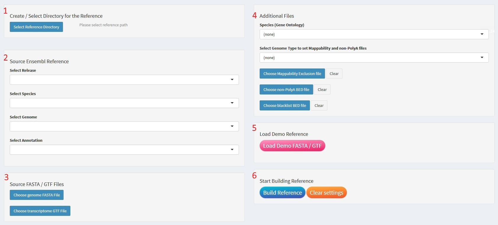
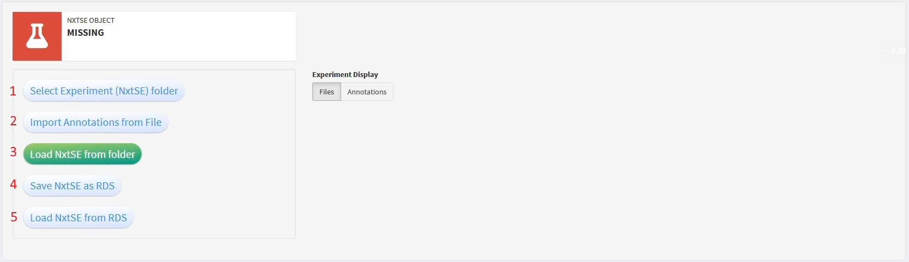
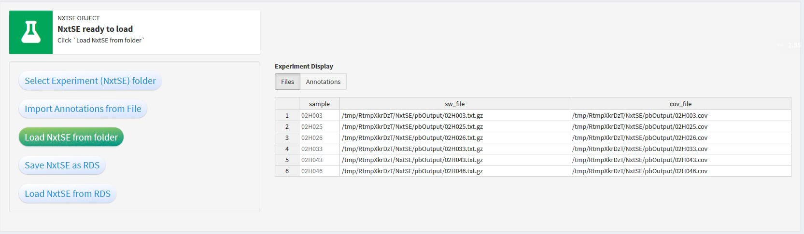
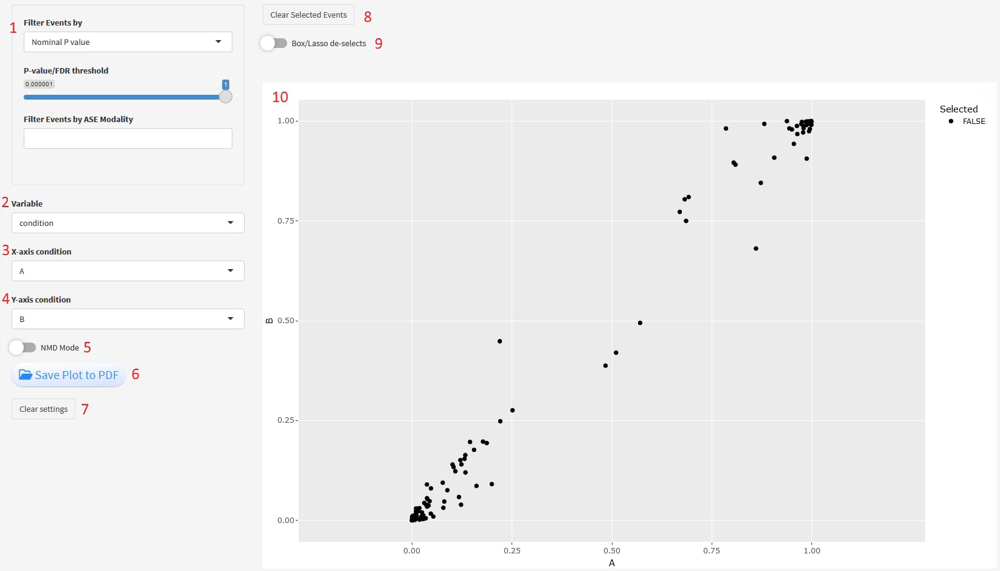
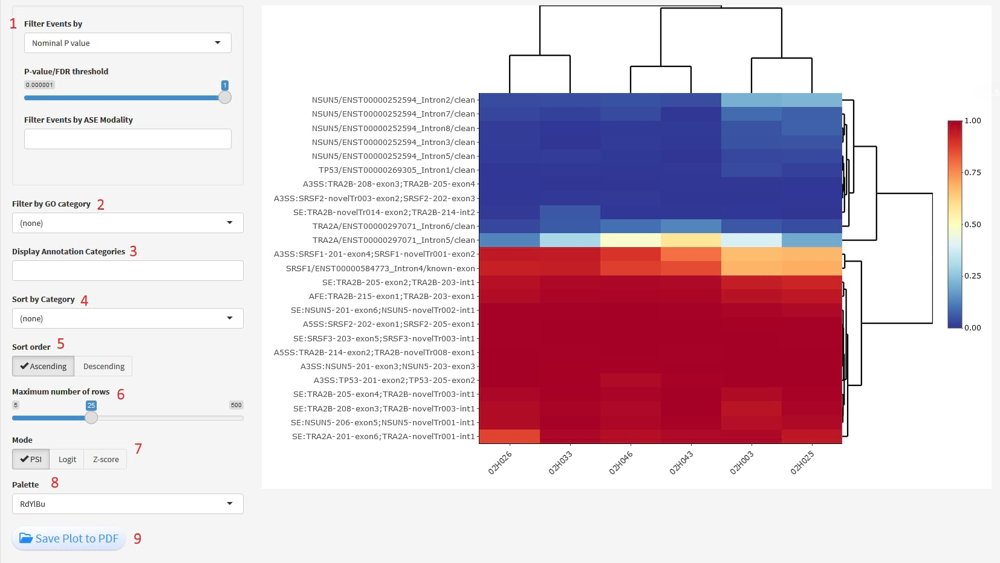

```{r, include = FALSE}
knitr::opts_chunk$set(
    collapse = TRUE,
    comment = "#>"
)
```
\

```{r, include = FALSE}
library(SpliceWiz)
```

# Introduction

SpliceWiz is a graphical interface for differential alternative splicing and
visualization in R. It differs from other alternative splicing tools as it is
designed for users with basic bioinformatic skills to analyze datasets
containing up to hundreds of samples! SpliceWiz contains a number of innovations
including:

* Super-fast handling of alignment BAM files using ompBAM, our developer
resource for multi-threaded BAM processing,
* Alternative splicing event (ASE) filters to remove problematic ASEs from
analysis
* Group-averaged coverage plots: publication-ready figures to clearly visualize
differential alternative splicing between biological / experimental conditions
* Interactive figures, including scatter and volcano plots, gene ontology (GO)
analysis, heatmaps, and scrollable coverage plots, 
powered using the shinyDashboard interface

This vignette is a runnable working example of the SpliceWiz workflow. The
purpose is to quickly demonstrate the basic functionalities of SpliceWiz.

We provide here a brief outline of the workflow for users to get started as
quickly as possible. However, we also provide more details for those wishing
to know more. Many sections will contain extra information that can be
displayed when clicked on, such as these:

<details>
<summary>Click on me for more details</summary>
\
In most sections, we offer more details about each step of the workflow, that
can be revealed in text segments like this one. Be sure to click on  buttons 
like these, where available.
</details>
\

# FAQ

<details>
<summary>How does SpliceWiz measure alternative splicing?</summary>
\

SpliceWiz defines alternative splicing events (ASEs) as binary events between 
two possibilities, the included and excluded isoform. It detects and measures:
skipped (casette) exons (SE), mutually-exclusive exons (MXE), alternative
5'/3' splice site usage (A5SS / A3SS), alternate first / last exon usage
(AFE / ALE), and retained introns (IR or RI).

SpliceWiz uses splice-specific read counts to measure ASEs. Namely, these are
junction reads (reads that align across splice sites). The exception is intron
retention (IR) whereby the (trimmed) mean read depth across the intron is
measured (identical to the method used in IRFinder).

SpliceWiz provides two metrics:

* Percent spliced in (PSI): is the expression of the included isoform as a
proportion of both included/excluded isoform. PSIs are measured for all types
of alternative splicing, including annotated retained introns (RI)
* IR-ratio: For introns, we also measure IR-ratios, which is the expression of
IR-transcript as a proportion of IR- and spliced-transcripts. Spliced transcript
expression is measured using either `SpliceOver` or `SpliceMax` method (the
latter is identical to that used in IRFinder)

</details>
\

<details>
<summary>Does SpliceWiz detect novel splicing events?</summary>
\
Novel splicing events are those in which at least one isoform is not an 
annotated transcript in the given gene annotation. SpliceWiz DOES detect novel
splicing events.

It detects novel events by using novel junctions, using pairs of junctions that
originate from or terminate at a common coordinate (novel alternate splice site
usage).

Additionally, SpliceWiz detects "tandem junction reads". These are reads that
span across two or more splice junctions. The region between splice junctions
can then be annotated as novel exons (if they are not identical to annotated
exons). These novel exons can then be used to measure novel casette exon
usage.

</details>
\

# Workflow from a glance

The basic steps of SpliceWiz are as follows:

* Building the SpliceWiz reference
* Process BAM files using SpliceWiz
* Collate results of individual samples into an experiment
* Importing the collated experiment as an NxtSE object
* Alternative splicing event filtering
* Differential ASE analysis
* Visualization
\
\

# Quick-Start

## Installation

To install SpliceWiz, start R (version "4.3") and enter: 

```{r eval=FALSE}
if (!requireNamespace("BiocManager", quietly = TRUE))
    install.packages("BiocManager")

BiocManager::install("SpliceWiz")
```
<details>
<summary>Setting up a Conda environment to use SpliceWiz</summary>
\
For those wishing to set up a self-contained environment with SpliceWiz 
installed (e.g. on a high performance cluster), we recommend using
miniconda. For installation instructions, see the 
[documentation on how to install miniconda](https://docs.conda.io/en/latest/miniconda.html)

After installing miniconda, create a conda environment as follows:

```{bash eval=FALSE}
conda create -n envSpliceWiz python=3.9
```

After following the prompts, activate the environment:

```{bash eval=FALSE}
conda activate envSpliceWiz
```

Next, install R 4.2.1 as follows:

```{bash eval=FALSE}
conda install -c conda-forge r-base=4.2.1
```

Many of SpliceWiz's dependencies are up-to-date from the conda-forge channel,
so they are best installed via conda:

```{bash eval=FALSE}
conda install -c conda-forge r-devtools r-essentials r-xml r-biocmanager \
  r-fst r-plotly r-rsqlite r-rcurl
```

After this is done, the remainder of the packages need to be installed from the
R terminal. This is because most Bioconductor packages are from the bioconda 
channel and appear not to be routinely updated. 

So, lets enter the R terminal from the command line:

```{bash eval=FALSE}
R
```

Set up Bioconductor 3.16:

```{r eval = FALSE}
BiocManager::install(version = "3.16")
```

Again, follow the prompts to update any necessary packages.

Once this is done, install SpliceWiz (devel) from github (as current devel
version can only be installed with Bioconductor devel which runs R 4.3, and this
is not readily available as a conda package)

```{r eval = FALSE}
# BiocManager::install("SpliceWiz")
devtools::install_github("alexchwong/SpliceWiz")
```

The last step will install any remaining dependencies, taking approximately
20-30 minutes depending on your system.

</details> 
\

<details>
<summary>Enabling OpenMP (multi-threading) for MacOS users (Optional)</summary>
\
For **MacOS** users, make sure OpenMP libraries are installed 
correctly. We recommend users follow this 
[guide](https://mac.r-project.org/openmp/), but the
quickest way to get started is to install `libomp` via brew:

```{bash eval=FALSE}
brew install libomp
```
</details> 
\

<details>
<summary>Installing statistical package dependencies (Optional)</summary>
\
SpliceWiz uses established statistical tools to perform alternative splicing
differential analysis:

* limma: models included and excluded counts as log-normal distributions
* DESeq2: models included and excluded counts as negative binomial distributions
* edgeR: models included and excluded counts as negative binomial distributions.
SpliceWiz uses the quasi-likelihood method which deals better with zero-counts.
* DoubleExpSeq: models included and excluded counts using beta binomial
distributions

To install all of these packages:

```{r eval=FALSE}
install.packages("DoubleExpSeq")

BiocManager::install(c("DESeq2", "limma", "edgeR"))
```

</details> 
\

## Loading SpliceWiz

```{r}
library(SpliceWiz)
```

<details>
<summary>Details</summary>
\
The SpliceWiz package loads the `NxtIRFdata` data package. This data package
contains the example "chrZ" genome / annotations and 6 example BAM files that
are used in this working example. Also, NxtIRFdata provides pre-generated
mappability exclusion annotations for building human and mouse SpliceWiz
references
</details> 
\

## The SpliceWiz Graphics User Interface (GUI)

SpliceWiz offers a graphical user interface (GUI) for interactive users, e.g.
in the RStudio environment. To start using SpliceWiz GUI:

```{r}
if(interactive()) {
    spliceWiz(demo = TRUE)
}
```
\

### Navigating the GUI

The SpliceWiz GUI uses the `shinyDashboard` interface. Use the side menu on the
left hand side of the interface to navigate across the various sub-panels in the
SpliceWiz GUI.

```{r, echo=FALSE, out.width='231pt', fig.align = 'center', fig.cap="Menu Side Bar"}
knitr::include_graphics("img/MenuBar.jpg")
```

## Building the SpliceWiz reference

<details>
<summary>Why do we need the SpliceWiz reference?</summary>
\
SpliceWiz first needs to generate a set of reference files. The SpliceWiz 
reference is used to quantitate alternative splicing in BAM files, 
as well as in downstream collation, differential analysis and visualisation.

SpliceWiz generates a reference from a user-provided genome FASTA and 
genome annotation GTF file, and is optimised for Ensembl references but can
accept other reference GTF files. Alternatively, SpliceWiz accepts AnnotationHub
resources, using the record names of AnnotationHub records as input.
</details> 
\

Using the example FASTA and GTF files, use the `buildRef()` function to build
the SpliceWiz reference:

```{r, results='hide', message = FALSE, warning = FALSE}
ref_path <- file.path(tempdir(), "Reference")
buildRef(
    reference_path = ref_path,
    fasta = chrZ_genome(),
    gtf = chrZ_gtf(),
    ontologySpecies = "Homo sapiens"
)
```

The SpliceWiz reference can be viewed as data frames using various getter
functions. For example, to view the annotated alternative splicing events (ASE):

```{r, results='hide', message = FALSE, warning = FALSE}
df <- viewASE(ref_path)
```

See `?View-Reference-methods` for a comprehensive list of getter functions

<details>
<summary>Using the GUI</summary>
\
After starting the SpliceWiz GUI in demo mode, 
click the `Reference` tab from the menu side bar. The following interface
will be shown:

```{r, echo=FALSE, out.width='1000pt', fig.align = 'center', fig.cap="Reference GUI"}

```

(1) The first step to building a SpliceWiz reference is to select a directory in
which to create the reference. 
(2) SpliceWiz provides an interface to retrieve the genome sequence (FASTA) and 
transcriptome annotation (GTF) files from the Ensembl FTP server, by first 
selecting the "Release" and then "Species" from the drop-down boxes.
(3) Alternatively, users can provide their own FASTA and GTF files. 
(4) Human (hg38, hg19) and mouse genomes (mm10, mm9) have the option of
further refining IR analysis using built-in mappability exclusion annotations,
allowing SpliceWiz to ignore intronic regions of low mappability.

For now, to continue with the demo and create the reference using the GUI, 
click on the `Load Demo FASTA/GTF` (5), and then click `Build Reference` (6)
</details>
\
<details>
<summary>Where did the FASTA and GTF files come from?</summary>
\
The helper functions `chrZ_genome()` and `chrZ_gtf()` returns the paths to the 
example genome (FASTA) and transcriptome (GTF) file included with the 
`NxtIRFdata` package that contains the working example used by SpliceWiz:

```{r}
# Provides the path to the example genome:
chrZ_genome()

# Provides the path to the example gene annotation:
chrZ_gtf()
```
</details> 
\
<details>
<summary>What is the chrZ genome?</summary>
\
For the purpose of generating a running example to demonstrate SpliceWiz, we
created an artificial genome / gene annotation. This was created using 7 human 
genes (SRSF1, SRSF2, SRSF3, 
TRA2A, TRA2B, TP53 and NSUN5). The SRSF and TRA family of genes all contain
poison exons flanked by retained introns. Additionally, NSUN5 contains an
annotated IR event in its terminal intron. Sequences from these 7 genes were
aligned into one sequence to create an artificial chromosome Z (chrZ). The gene
annotations were modified to only contain the 7 genes with the modified genomic
coordinates.
</details>
\
<details>
<summary>What is the gene ontology species?</summary>
\
SpliceWiz supports gene ontology analysis. To enable this capability, we first
need to generate the gene ontology annotations for the appropriate species.

To see a list of supported species:

```{r}
getAvailableGO()
```

Note that, if `genome_type` is specified to a supported genome, the
human / mouse gene ontology annotation will be automatically generated.

</details>
\
<details>
<summary>What is Mappability and why should I care about it?</summary>
\
For the most part, the SpliceWiz reference can be built with just the FASTA and
GTF files. This is sufficient for assessment for most forms of alternative
splicing events.

For intron retention, accurate assessment of intron depth is important. However,
introns contain many repetitive regions that are difficult to map. We refer to
these regions as "mappability exclusions".

We adopt IRFinder's algorithm to identify these mappability exclusions. This is
determined empirically by generating synthetic reads systematically from the 
genome, then aligning these reads back to the same genome. Regions that contain
less than the expected coverage depth of reads define "mappability exclusions".

See the vignette: SpliceWiz cookbook for details on how to generate
"mappability exclusions" for any genome.\
</details>
\
<details>
<summary>How do I use pre-built mappability exclusions to generate human and
mouse references?</summary>
\
For human and mouse genomes, SpliceWiz provides pre-built mappability
exclusion references that can be used to build the SpliceWiz reference. 
SpliceWiz provides these annotations via the `NxtIRFdata` package.

Simply specify the genome in the parameter `genome_type` in the `buildRef()`
function (which accepts `hg38`, `hg19`, `mm10` and `mm9`).

Additionally, a reference for non-polyadenylated transcripts is used. This has
a minor role in QC of samples (to assess the adequacy of polyA capture).

For example, assuming your genome file `"genome.fa"` and a transcript annotation
`"transcripts.gtf"` are in the working directory, a SpliceWiz reference can be 
built using the built-in `hg38` low mappability regions and non-polyadenylated
transcripts as follows:

```{r eval = FALSE}
## NOT RUN

ref_path_hg38 <- "./Reference"
buildRef(
    reference_path = ref_path_hg38,
    fasta = "genome.fa",
    gtf = "transcripts.gtf",
    genome_type = "hg38"
)
```
</details>
\

## Process BAM files using SpliceWiz

The function `SpliceWiz_example_bams()` retrieves 6 example BAM files from
ExperimentHub and places a copy of these in the temporary directory.

```{r}
bams <- SpliceWiz_example_bams()
```

<details>
<summary>What are these example BAM files and how were they generated?</summary>
\
In this vignette, we provide 6 example BAM files. These were generated based on
aligned RNA-seq BAMs of 6 samples from the Leucegene AML dataset (GSE67039).
Sequences aligned to hg38 were filtered to only include genes aligned to that
used to create the chrZ chromosome. These sequences were then re-aligned to
the chrZ reference using STAR.\
</details>
\
<details>
<summary>How can I easily locate multiple BAM files?</summary>
\
Often, alignment pipelines process multiple samples. SpliceWiz provides 
convenience functions to recursively locate all the BAM files in a given folder,
and tries to ascertain sample names. Often sample names can be gleaned when:
* The BAM files are named by their sample names, e.g. "sample1.bam", 
"sample2.bam". In this case, `level = 0`
* The BAM files have generic names but are contained inside parent directories
labeled by their sample names, e.g. "sample1/Unsorted.bam", 
"sample2/Unsorted.bam". In this case, `level = 1`

```{r}
# as BAM file names denote their sample names
bams <- findBAMS(tempdir(), level = 0) 

# In the case where BAM files are labelled using sample names as parent 
# directory names (which oftens happens with the STAR aligner), use level = 1
```
</details>
\

Process these BAM files using SpliceWiz:

```{r, results='hide', message = FALSE, warning = FALSE}
pb_path <- file.path(tempdir(), "pb_output")
processBAM(
    bamfiles = bams$path,
    sample_names = bams$sample,
    reference_path = ref_path,
    output_path = pb_path
)
```
\
<details>
<summary>Using the GUI</summary>
\
After building the demo reference as shown in the previous section, start
SpliceWiz GUI in demo mode. Then, 
click the `Experiment` tab from the menu side bar. The following interface
will be shown:

```{r, echo=FALSE, out.width='8000pt', fig.align = 'center', fig.cap="Experiment GUI"}
knitr::include_graphics("img/Expr_empty.jpg")
```

The buttons on the left hand side are as follows:

(1) Set the folders containing the SpliceWiz reference, BAM files, and the
output (NxtSE) folder
(2) Run `processBAM` (process BAM files)
(3) Import annotations from a tabular text file (such as a csv file)
(4) Settings for `collateData` - collating the experiment 
(5) Run `collateData` (collating the experiment)
(6) Import/Export current sample annotations from/to the NxtSE folder, or
export annotations as a csv file
(7) Set the number of threads used to run `processBAM` and `collateData 
functions

Also, (8) is a row of tabs that toggle between different tables, showing
details of the Reference, BAM files, processBAM output Files, and sample
Annotations

To continue with our example, click on 
(1) `Define Project Folders` to bring up the following drop-down box:

```{r, echo=FALSE, out.width='360pt', fig.align = 'center', fig.cap="Define Project Folders"}
knitr::include_graphics("img/Expr_drop_2.jpg")
```

We need to define the folders that contain our reference, BAM files, as well
as the experiment (NxtSE) output folder for the final compiled experiment

* Click on `Choose Reference Folder` and select the `Reference` directory
(where the SpliceWiz reference was generated by the previous step. Then,
* Click on `Choose BAM Folder` and select the `bams` directory
(where the demo BAM files have been generated). 
* Click on `Choose / Create Experiment (NxtSE) Folder` and select the 
`NxtSE` directory (which should currently be empty except for the `pbOutput`
subdirectory). Note that when an Experiment folder is chosen via this step,
a `pbOutput` subdirectory will be created if it does not already exist

After our folders have been defined, on the right hand side, an interactive
table should be displayed that looks like the following:

```{r, echo=FALSE, out.width='1000pt', fig.align = 'center', fig.cap="Running processBAM"}
knitr::include_graphics("img/Expr_pb.jpg")
```

To process the example BAM files, first make sure the BAM files you wish to
process have been selected (BAM files can be unselected by removing the ticks
in the `selected` column). Also, users have the option of renaming the samples
(by setting the names in the `sampleName` column).

To continue with our example, lets leave the names as-is. Click the 
`Process Selected BAMs` button. A prompt should pop up asking for confirmation. 
Click `OK` to start running processBAM.

</details>
\
<details>
<summary>What is the `processBAM()` function</summary>
\
SpliceWiz's `processBAM()` function can process one or more BAM files. This
function is ultra-fast, relying on an internal native C++ function that uses
OpenMP multi-threading (via the `ompBAM` C++ API). 

Input BAM files can be either read-name sorted or coordinate sorted (although
SpliceWiz prefers the former). Indexing of coordinate-sorted BAMs are not
necessary.

`processBAM()` loads the SpliceWiz reference. Then, it reads each BAM file in
their entirety, and quantifies the following:

* Basic QC parameters including number of reads, directionality, etc
* Counts of gapped (junction) reads / fragments
* Intron coverage depths and other parameters (identical output to IRFinder)
* COV files (which are like BigWig files but record strand-specific coverage)
* Miscellaneous quants including coverage of chromosomes, intergenic regions,
rRNAs, and non-polyadenylated regions

For each BAM file, `processBAM()` generates two output files. The first is a
gzipped text file containing all the quantitation data. The second is a `COV`
file which contains the per-nucleotide RNA-seq coverage of the sample.\
</details>
\
<details>
<summary>More details on the `processBAM()` function</summary>
\
At minimum, `processBAM()` requires four parameters:

* `bamfiles` : The paths of the BAM files
* `sample_names` : The sample names corresponding to the given BAM files
* `reference_path` : The directory containing the SpliceWiz reference
* `output_path` : The directory where the output of `processBAM()` should go

```{r, results='hide', message = FALSE, warning = FALSE}
pb_path <- file.path(tempdir(), "pb_output")
processBAM(
    bamfiles = bams$path,
    sample_names = bams$sample,
    reference_path = ref_path,
    output_path = pb_path
)
```

`processBAM()` also takes several optional, but useful, parameters:

* `n_threads` : The number of threads for multi-threading
* `overwrite` : Whether existing files in the output directory should be
overwritten
* `run_featureCounts` : (Requires the Rsubread package) runs featureCounts to
obtain gene counts (which outputs results as an RDS file)

For example, to run `processBAM()` using 2 threads, disallow overwrite of
existing `processBAM()` outputs, and run featureCounts afterwards, one would
run the following:

```{r, eval = FALSE}
# NOT RUN

# Re-run IRFinder without overwrite, and run featureCounts
require(Rsubread)

processBAM(
    bamfiles = bams$path,
    sample_names = bams$sample,
    reference_path = ref_path,
    output_path = pb_path,
    n_threads = 2,
    overwrite = FALSE,
    run_featureCounts = TRUE
)

# Load gene counts
gene_counts <- readRDS(file.path(pb_path, "main.FC.Rds"))

# Access gene counts:
gene_counts$counts
```
</details>
\

## Collate the experiment

The helper function `findSpliceWizOutput()` organises the output files of
SpliceWiz's `processBAM()` function. It identifies matching `"txt.gz"` and 
`"cov"` files for each sample, and organises these file paths conveniently
into a 3-column data frame:

```{r}
expr <- findSpliceWizOutput(pb_path)
```

Using this data frame, collate the experiment using `collateData()`. We name
the output directory as `NxtSE_output` as this folder will contain the data
needed to import the NxtSE object:

```{r, results='hide', message = FALSE, warning = FALSE}
nxtse_path <- file.path(tempdir(), "NxtSE_output")
collateData(
    Experiment = expr,
    reference_path = ref_path,
    output_path = nxtse_path
)
```
\
<details>
<summary>What is the `collateData()` function</summary>
\
`collateData()` combines the `processBAM()` output files of multiple samples and
builds a single database. `collateData()` creates a number of files in the
chosen output directory. These outputs can then be imported into the R session
as a `NxtSE` data object for downstream analysis.

At minimum, `collateData()` takes the following parameters:

* `Experiment` : The 2- or 3- column data frame. The first column should contain
(unique) sample names. The second and (optional) third columns contain the 
`"txt.gz"` and `"cov"` file paths
* `reference_path` : The directory containing the SpliceWiz reference
* `output_path` : The directory where the output of `processBAM()` should go

`collateData()` can take some optional parameters:

* `IRMode` : Whether to use SpliceWiz's `SpliceOver` method, or IRFinder's 
`SpliceMax` method, to determine total spliced transcript abundance. Briefly,
`SpliceMax` considers junction reads that have either flanking splice site
coordinate. `SpliceOver` considers additional junction reads that splices
across exon clusters in common. Exon clusters are groups of mutually-overlapping
exons. `SpliceOver` is the default option.
* `overwrite` : Whether files in the output directory should be overwritten
* `n_threads` : Use multi-threaded operations where possible
* `lowMemoryMode` : Minimise memory usage where possible. Note that most of the
collateData pipeline will be single-threaded if this is set to `TRUE`.

`collateData()` is a memory-intensive operation when run using multiple threads.
We estimate it can use up to 6-7 Gb per thread. `lowMemoryMode` will minimise
RAM usage to ~ 8 Gb, but will be slower and run on a single thread.\
</details>

\
<details>
<summary>Enabling novel splicing detection</summary>
\
Novel splicing detection can be switched on by setting `novelSplicing = TRUE`
from within the `collateData()` function:

```{r, results='hide', message = FALSE, warning = FALSE}
# Modified pipeline - collateData with novel ASE discovery:

nxtse_path <- file.path(tempdir(), "NxtSE_output_novel")
collateData(
    Experiment = expr,
    reference_path = ref_path,
    output_path = nxtse_path,
    novelSplicing = TRUE     ## NEW ##
)
```

`collateData()` uses split reads that are not annotated introns to help 
construct hypothetical minimal transcripts. These are then injected into the
original transcriptome annotation (GTF) file, whereby the SpliceWiz reference
is rebuilt. The new SpliceWiz reference (which contains these novel transcripts)
is then used to collate the samples.

To reduce false positives in novel splicing detection, SpliceWiz provides 
several filters to reduce the number of novel junctions fed into the analysis:

* Novel junctions that are lowly expressed (only in a small number of samples)
are removed. The minimum number of samples required to retain a novel junction
is set using `novelSplicing_minSamples` parameter
* Alternately, junctions are retained if its expression exceeds a certain
threshold (set using `novelSplicing_countThreshold`) in a smaller number of
samples (set using `novelSplicing_minSamplesAboveThreshold`)
* Further, novel junctions can be filtered by requiring at least one end to be
an annotated splice site (this is enabled using 
`novelSplicing_requireOneAnnotatedSJ = TRUE`).

For example, if one wished to retain novel reads seen in 3 or more samples, or
novel spliced reads with 10 or more counts in at least 1 sample, and requiring
at least one end of a novel junction being an annotated splice site:

By default, tandem junction reads (reads that align across two or more splice
junctions) are used to detect novel exons. This can be turned off by setting
`novelSplicing_useTJ = FALSE`.

```{r eval = FALSE}
nxtse_path <- file.path(tempdir(), "NxtSE_output_novel")
collateData(
    Experiment = expr,
    reference_path = ref_path,
    output_path = nxtse_path,
    
        ## NEW ##
    novelSplicing = TRUE,
        # switches on novel splice detection
    
    novelSplicing_requireOneAnnotatedSJ = TRUE,
        # novel junctions must share one annotated splice site

    novelSplicing_minSamples = 3,
        # retain junctions observed in 3+ samples (of any non-zero expression)
    
    novelSplicing_minSamplesAboveThreshold = 1,
        # only 1 sample required if its junction count exceeds a set threshold
    novelSplicing_countThreshold = 10  ,
        # threshold for previous parameter

    novelSplicing_useTJ = TRUE
        # whether tandem junction reads should be used to identify novel exons
)
```

</details>
\
<details>
<summary>Using the GUI to annotate the experiment</summary>
\
After running the Reference and processBAM steps as indicated in the previous
sections (of the GUI instructions), there is an option to assign annotations
to the experiment prior to collation. Annotations can be assigned from existing
tabular files (such as csv files). For this example, we will demonstrate
how to use a csv file containing annotations to annotate our experiment. Note
that the annotation table should contain matching sample names in its leftmost
column.

To select a file containing annotations, click on `Import Annotations from file`,
then select the `demo_annotations.csv` file that should be in the working
directory. Press ok. Your interface should now look like this:

```{r, echo=FALSE, out.width='1000pt', fig.align = 'center', fig.cap="Importing annotations"}

```

Note that an extra button `Add / Remove Annotation Columns` (*) has appeared.
Clicking on this button allows us to add/remove annotation columns

```{r, echo=FALSE, out.width='360pt', fig.align = 'center', fig.cap="Adding annotation columns"}

```

Using this panel, columns can be added or removed by clicking their
corresponding buttons. Data types for columns can also be defined here.
</details>
\

<details>
<summary>Using the GUI to collate the experiment</summary>
\

After annotating the experiment in the step above, click on the
`Experiment Settings` button. Then enable `Look for Novel Splicing` to bring
up the following display:

```{r, echo=FALSE, out.width='480pt', fig.align = 'center', fig.cap="collateData GUI"}

```

This drop-down dialog box contains several parameters related to novel splicing
detection:

(1) Toggle on/off novel splice detection
(2) Restrict novel junction reads to having one annotated splice site
(3) Filter novel junction counts based on the number of samples in which the
novel junction was observed (any non-zero amount)
(4) Filter novel junction counts based on expression threshold 
(min number of samples set here)
(5) Threshold junction read count (expression threshold based novel junction 
filter)
(6) Whether to utilize tandem junction to define novel exons

Also, there is an option (7) to overwrite a previously-compiled NxtSE in the
same folder. There is also an option to clear all the Reference/BAM/NxtSE
folders (8).

For this example, we will leave the settings as above. Proceed to run
collateData() by clicking on `Collate Experiment`. After several moments,
a pop-up message should be shown when the experiment has been successfully
collated.

</details>
\

## Importing the experiment

Before differential analysis can be performed, the collated experiment must be
imported into the R session as an `NxtSE` data object.

After running `collateData()`, import the experiment using the 
`makeSE()` function:

```{r, results='hide', message = FALSE, warning = FALSE}
se <- makeSE(nxtse_path)
```
\
<details>
<summary>Using the GUI</summary>
\
After running the steps in the previous GUI sections, navigate to `Analysis`
and then click the `Load Experiment` on the menu bar. The display should
look like this:

```{r, echo=FALSE, out.width='1000pt', fig.align = 'center', fig.cap="Loading the NxtSE GUI"}

```

The buttons on the left hand side are as follows:

(1) Select the NxtSE folder containing the collated experiment
(2) Import annotations from file (tabular format such as csv file)
(3) Load NxtSE from folder (into current session for downstream analysis)
(4) After NxtSE has been loaded, it can be saved as an RDS file to send to
collaborators (note that COV files will be disconnected once the file has been
moved to a different location; it is best to give your collaborators the NxtSE 
folder instead, with the COV files inside the `pbOutput` subdirectory)
(5) Load NxtSE from RDS file (saved via the prior step)

To continue with our example, click the `Select Experiment (NxtSE) Folder`, then 
select the `NxtSE` directory. 
The interface should now look like this:

```{r, echo=FALSE, out.width='1000pt', fig.align = 'center', fig.cap="Loading the NxtSE GUI"}

```

To view any existing annotations, click the `Annotations` tab in the 
`Experiment Display` above the sample table. 
If you followed the prior steps in the `Collate the experiment` section, 
there should already be annotations here. 
If not, feel free to add annotations using the
`Import Annotations from File` (and click on "demo_annotations.csv" file), or
manually add and annotate columns by clicking on the
`Add / Remove Annotation Columns` button to open the drop-down box.

To load the NxtSE object, click the `Load NxtSE from Folder` to which will
load the NxtSE object into the current session. A pop-up will appear once the
NxtSE object has been successfully completed.

</details>
\
<details>
<summary>What is the `makeSE()` function</summary>
\
The `makeSE()` function imports the compiled data generated by the 
`collateData()` function. Data is imported as an `NxtSE` object. Downstream
analysis, including differential analysis and visualization, is performed using
the `NxtSE` object.
\
</details>
\
<details>
<summary>More details about the `makeSE()` function</summary>
\
By default, `makeSE()` uses delayed operations to avoid consuming memory
until the data is actually needed. This is advantageous in analysis of hundreds
of samples on a computer with limited resources. However, it will be slower. To
load all the data into memory, we need to "realize" the NxtSE object, as
follows:

```{r}
se <- realize_NxtSE(se)
```

Alternatively, `makeSE()` can realize the NxtSE object at construction:

```{r eval = FALSE}
se <- makeSE(nxtse_path, realize = TRUE)
```

By default, `makeSE()` constructs the NxtSE object using all the samples in
the collated data. It is possible (and particularly useful in large data sets)
to read only a subset of samples. In this case, construct a data frame object
with the first column containing the desired sample names and parse this into
the `colData` parameter as shown:

```{r, eval = FALSE}
subset_samples <- colnames(se)[1:4]
df <- data.frame(sample = subset_samples)
se_small <- makeSE(nxtse_path, colData = df, RemoveOverlapping = TRUE)
```

In complex transcriptomes including those of human and mouse, alternative
splicing implies that introns are often overlapping. Thus, algorithms run the
risk of over-calling intron retention where overlapping introns are assessed.
SpliceWiz removes overlapping introns by considering only introns belonging to
the major splice isoforms. It estimates a list of introns of major isoforms
by assessing the compatible splice junctions of each isoform, and removes
overlapping introns belonging to minor isoforms. To disable this functionality,
set `RemoveOverlapping = FALSE`.
\
</details>
\

## Differential analysis

### Assigning annotations to samples

```{r}
colData(se)$condition <- rep(c("A", "B"), each = 3)
colData(se)$batch <- rep(c("K", "L", "M"), 2)
```

NB: to add annotations via the GUI workflow, see the `Collate the experiment`
section.

\
<details>
<summary>Saving and reloading the NxtSE as an RDS file (GUI)</summary>
\
Once an NxtSE object has been loaded into memory, you can save it as an RDS
object so it can be reloaded in a later session. To do this, click the
`Save NxtSE as RDS` button. Choose a file
name and location and press `OK`. This RDS file can be loaded as an NxtSE
object in a later GUI session by clicking the `Load NxtSE from RDS` button.

</details>
\
<details>
<summary>What is the `NxtSE` object</summary>
\
`NxtSE` is a data object which contains all the required data for downstream
analysis after all the BAM alignment files have been process and the experiment
is collated.

```{r}
se
```

The `NxtSE` object inherits the `SummarizedExperiment` object. This means that
the functions for SummarizedExperiment can be used on the NxtSE object. These
include row and column annotations using the `rowData()` and `colData()`
accessors.

Rows in the `NxtSE` object contain information about each alternate splicing 
event. For example:

```{r}
head(rowData(se))
```

Columns contain information about each sample. By default, no annotations are
assigned to each sample. These can be assigned as shown above.

Also, `NxtSE` objects can be subsetted by rows (ASEs) or columns (samples). This
is useful if one wishes to perform analysis on a subset of the dataset, or only
on a subset of ASEs (say for example, only skipped exon events). Subsetting is
performed just like for `SummarizedExperiment` objects:

```{r}
# Subset by columns: select the first 2 samples
se_sample_subset <- se[,1:2]

# Subset by rows: select the first 10 ASE events
se_ASE_subset <- se[1:10,]
```
\
</details>
\

### Filtering high-confidence events

SpliceWiz offers default filters to identify and remove low confidence
alternative splice events (ASEs). Run the default filter using the following:

```{r}
se.filtered <- se[applyFilters(se),]
```
\
<details>
<summary>Using the GUI</summary>
\
After following the GUI tutorials in the prior sections, click on `Analysis`
and then `Filters` from the menu bar. It should look like this:

```{r, echo=FALSE, out.width='800pt', fig.align = 'center', fig.cap="Filters - GUI"}
knitr::include_graphics("img/Filters_empty.jpg")
```

To load SpliceWiz's default filters, click the top right button 
`Load Default Filters`. Then to apply these filters to the NxtSE, click 
`Apply Filters`. After the filters have been run, your session should now look
like this:

```{r, echo=FALSE, out.width='800pt', fig.align = 'center', fig.cap="SpliceWiz default filters- GUI"}

```
</details>
\

<details>
<summary>Why do we need to filter alternative splicing events?</summary>
\
Often, the gene annotations contain isoforms for all discovered splicing events.
Most annotated transcripts are not expressed, and their inclusion in 
differential analysis complicates results including adjusting for multiple 
testing. It is prudent to filter these out using various approaches, akin to 
removing genes with low gene counts in differential gene analysis. We suggest
using the default filters which work well for small experiments with sequencing
depths at 100-million paired-end reads.

To learn more about filters, consult the documentation via `?ASEFilters`
</details>
\

### Performing differential analysis

Using the edgeR wrapper `ASE_edgeR()`, perform differential ASE analysis between
conditions "A" and "B":

```{r, results='hide', message = FALSE, warning = FALSE}
# Requires edgeR to be installed:
require("edgeR")
res_edgeR <- ASE_edgeR(
    se = se.filtered,
    test_factor = "condition",
    test_nom = "B",
    test_denom = "A"
)
```

<details>
<summary>Using the GUI</summary>
\
After running the previous sections (of the GUI instructions), click `Analysis`
and then `Differential Expression Analysis` on the menu side bar. It should look
something like this:

```{r, echo=FALSE, out.width='800pt', fig.align = 'center', fig.cap="Differential Expression GUI"}

```

To perform edgeR-based differential analysis, first ensure `Method` is set to
`edgeR`. Using the `Variable` drop-down box, select `condition`. Then, select
the `Nominator` and `Denominator` fields to `B` and `A`, respectively. Leave
the batch factor fields as `(none)`. Then, click `Perform DE`.

Once differential expression analysis has finished, your session should look
like below. The output is a DT-based data table equivalent to the `ASE_edgeR()`
function.

```{r, echo=FALSE, out.width='800pt', fig.align = 'center', fig.cap="Differential Expression (edgeR) GUI"}

```

NB: The interface allows users to choose to sort the results either by nominal
or (multiple-testing) adjusted P values

NB2: There are 3 different ways Intron Retention events can be quantified and
analysed - see "What are the different ways intron retention is measured?" below
for further details.

NB3: Analyses can be saved or loaded to/from RDS files using the corresponding
buttons.

</details>
\
<details>
<summary>What are the options for differential ASE analysis?</summary>
\
SpliceWiz provides wrappers to three established algorithms:

* `ASE_limma` uses `limma` to model isoform counts as log-normal distributions.
Limma is probably the fastest method and is ideal for large datasets.
Time series analysis is available for this mode.
* `ASE_DESeq` uses `DESeq2` to model isoform counts as negative binomial
distribution. This method is the most computationally expensive, but gives
robust results. Time series analysis is also available for this mode
* `ASE_edgeR` uses `edgeR` to model isoform counts as negative binomial
distributions. SpliceWiz uses the quasi-likelihood method that deals better
with variance at near-zero junction counts, resulting in reduced false 
positives.
* `ASE_DoubleExpSeq` uses the lesser-known CRAN package `DoubleExpSeq`. This
package uses the beta-binomial distribution to model isoform counts. The method
is at least as fast as `limma`, but for now it is restricted to analysis
between two groups (i.e. batch correction is not implemented)

We recommend the following for differential analysis:

* For quick comparisons between two groups, where no batch factors are involved,
we recommend **DoubleExpSeq**
* For large complex experiments where quick results are required for a
preliminary or exploratory analysis, we recommend **limma**
* For final analysis where accuracy is paramount, we recommend **edgeR** or
**DESeq2**

```{r, results='hide', message = FALSE, warning = FALSE}
# Requires limma to be installed:
require("limma")
res_limma <- ASE_limma(
    se = se.filtered,
    test_factor = "condition",
    test_nom = "B",
    test_denom = "A"
)

# Requires DoubleExpSeq to be installed:
require("DoubleExpSeq")
res_DES <- ASE_DoubleExpSeq(
    se = se.filtered,
    test_factor = "condition",
    test_nom = "B",
    test_denom = "A"
)

# Requires DESeq2 to be installed:
require("DESeq2")
res_deseq <- ASE_DESeq(
    se = se.filtered,
    test_factor = "condition",
    test_nom = "B",
    test_denom = "A",
    n_threads = 1
)

# Requires edgeR to be installed:
require("edgeR")
res_edgeR <- ASE_edgeR(
    se = se.filtered,
    test_factor = "condition",
    test_nom = "B",
    test_denom = "A"
)
```
\
</details>
\
<details>
<summary>What are the different ways intron retention is measured?</summary>
\
Intron retention can be measured via two approaches.

The first (and preferred) approach is using IR-ratio. We presume that every
intron is potentially retained (thus ignoring annotation). Given this results in
many overlapping introns, SpliceWiz adjusts for this via the following:

* Where there are mutually-overlapping introns, the less abundant intron is
removed from the analysis. Abundance is estimated across the entire dataset, and
less-abundant overlapping introns are removed at the `makeSE()` step.
* IR-ratio measures included (intronic) abundance using an identical approach
to IRFinder, i.e., it calculates the trimmed mean of sequencing depth across the
intron, excluding annotated outliers (other exons, intronic elements). Given we
cannot assume whether the exact intron corresponds to the major isoform, we
estimate splicing abundance by summing junction reads that share either exon
cluster as the intron of interest (`SpliceOver` method in SpliceWiz). 
Alternately, users can choose to use IRFinder's `SpliceMax` method, summing
junction reads that share either splice junction with the intron of interest.
This choice is also made by the user at the `makeSE()` step.

At the differential analysis step, users can choose the following:

* `IRmode = "all"` - all introns are potentially retained, use IR-ratio to 
quantify IR (`EventType = "IR"`)
* `IRmode = "annotated"` - only annotated retained intron events are considered,
but use IR-ratio to quantify IR (`EventType = "IR"`)
* `IRmode = "annotated_binary"` - only annotated retained intron events are
considered, use PSI to quantify IR - which considers the IR-transcript and
the transcript isoform with the exactly-spliced intron as binary alternatives.
Splicing of overlapping introns are not considered in PSI quantitation.


```{r, results='hide', message = FALSE, warning = FALSE}
res_edgeR_allIntrons <- ASE_edgeR(
    se = se.filtered,
    test_factor = "condition",
    test_nom = "B",
    test_denom = "A",
    IRmode = "all"
)

res_edgeR_annotatedIR <- ASE_edgeR(
    se = se.filtered,
    test_factor = "condition",
    test_nom = "B",
    test_denom = "A",
    IRmode = "annotated"
)

res_edgeR_annotated_binaryIR <- ASE_edgeR(
    se = se.filtered,
    test_factor = "condition",
    test_nom = "B",
    test_denom = "A",
    IRmode = "annotated_binary"
)
```
\
</details>
\

<details>
<summary>Can I account for batch factors?</summary>
\
`ASE_limma`, `ASE_edgeR`, and `ASE_DESeq` can accept up to 2
categories of batches from which to normalize. For example, to normalize the 
analysis by the `batch` category, one would run:

```{r, results='hide', message = FALSE, warning = FALSE}
require("edgeR")
res_edgeR_batchnorm <- ASE_edgeR(
    se = se.filtered,
    test_factor = "condition",
    test_nom = "B",
    test_denom = "A",
    batch1 = "batch"
)
```
\
</details>
\
<details>
<summary>Can I do time series analysis?</summary>
\
Time series analysis can be performed using limma, edgeR, and DESeq2. 

For limma and edgeR, time series analysis is done using the 
`ASE_limma_timeseries()` and `ASE_edgeR_timeseries()`
function. `test_factor`, despite its name, should be a column in `colData(se)`
containing numerical values that represent time series data.

Note that these time series wrappers function requires the `splines` package.

```{r, results='hide', message = FALSE, warning = FALSE}
colData(se.filtered)$timevar <- rep(c(0,1,2), 2)

require("splines")
require("limma")
res_limma_cont <- ASE_limma_timeseries(
    se = se.filtered,
    test_factor = "timevar"
)

require("splines")
require("edgeR")
res_edgeR_cont <- ASE_edgeR_timeseries(
    se = se.filtered,
    test_factor = "timevar"
)

```

For DESeq2, time series analysis is performed using the `ASE_DESeq()` funcction.
The key difference is that, for time series analysis, simply do not specify the 
`test_nom` and `test_denom` parameters. As long as the `test_factor` contains 
numeric values, `ASE_DESeq` will treat it as a continuous variable. See the 
following example:

```{r, results='hide', message = FALSE, warning = FALSE}
colData(se.filtered)$timevar <- rep(c(0,1,2), 2)

require("DESeq2")
res_deseq_cont <- ASE_DESeq(
    se = se.filtered,
    test_factor = "timevar"
)
```
\
</details>
\
<details>
<summary>Advanced GLM-based differential ASE analysis with edgeR</summary>
\

We have implemented wrapper functions enabling advanced users to perform
differential ASE analysis by constructing their own design matrices. This allows
users to evaluate effects of covariates in complex experimental models.

We will be building a separate vignette to illustrate the full functionality
of these edgeR-based functions, but for now a quick example can be found in the
relevant documentation, which can be viewed via:

```{r, eval = FALSE}
?`ASE-GLM-edgeR`
```
\
</details>
\

## Visualization

### Volcano plots

Volcano plots show changes in PSI levels (log fold change, x axis) against
statistical significance (-log10 p values, y axis):

```{r, fig.width = 7, fig.height = 5, eval = Sys.info()["sysname"] != "Darwin"}
library(ggplot2)

ggplot(res_edgeR,
        aes(x = logFC, y = -log10(FDR))) + 
    geom_point() +
    labs(title = "Differential analysis - B vs A",
         x = "Log2-fold change", y = "FDR (-log10)")
```

<details>
<summary>Can I visualize significant events for each modality of
alternative splicing events?</summary>
\
Yes. We can use `ggplot2`'s `facet_wrap` function to separately plot volcanos
for each modality of ASE. The type of ASE is contained in the `EventType` column
of the differential results data frame.

```{r, fig.width = 7, fig.height = 5, eval = Sys.info()["sysname"] != "Darwin"}
ggplot(res_edgeR,
        aes(x = logFC, y = -log10(FDR))) + 
    geom_point() + facet_wrap(vars(EventType)) +
    labs(title = "Differential analysis - B vs A",
         x = "Log2-fold change", y = "FDR (-log10)")
```
\
</details>
\
<details>
<summary>Using the GUI</summary>
\
After following the previous sections including differential analysis, navigate
to `Display` and then `Volcano Plot`. Notice that there will be a message
that says "No events found. Consider relaxing some filters".

This message occurs because our example dataset has no differential events
that surpass an adjusted P value of less than 0.05 (which is the default
filter setting). The SpliceWiz GUI avoids plotting all ASEs as this will crowd
the visualization. In this example, change the `Filter Events by` to 
`Nominal P value`, and move the `P-value/FDR threshold` all the way to the
right. There should now be a volcano plot but most events have
near-zero significance because the default y-axis setting is to 
`Plot adjusted P values`. Switch this off to show the following:

```{r, echo=FALSE, out.width='800pt', fig.align = 'center', fig.cap="Volcano Plot - GUI"}
knitr::include_graphics("img/Vis_volcano.jpg")
```

You can customize this volcano plot using the following controls:

(1) Use the filtering panel to adjust the number of events to show. Here,
events can be filtered by Nominal or adjusted P values, or by top events.
We can also filter by "highlighted events" which is useful for gene ontology
analysis and heatmaps later. Events can also be filtered by the type of 
alternative splicing
(2) The volcano plot can be faceted by the type of alternative splicing.
(3) The y axis can show either nominal or adjusted P values
(Benjamini Hochberg).
(4) If `NMD Mode` is `ON`, the horizontal axis represents whether splicing
is shifted towards (positive values) or away from (negative values) a NMD
substrate transcript
(5) The plot can be exported as a pdf file (ggplot object)
(6) Clear settings

Also, on the (right hand side) main panel:

(7) This clears any selected events (selected events are highlighted in red)
(8) Toggle between using tools to select or deselect events
(9) Plotly interactive toolbox. Users can use the box-select (9a) or lasso-
select (9b) to select (or de-select) one or more events of interest. Selected
events are highlighted in other plots and non-selected points can be removed
by selecting "highlighted events" in the event filter panel (1).

</details>
\

### Scatter plots

Scatter plots are useful for showing splicing levels (percent-spliced-in, PSI)
between two conditions. The results from differential analysis contains these
values and can be plotted:

```{r, fig.width = 7, fig.height = 5, eval = Sys.info()["sysname"] != "Darwin"}
library(ggplot2)

ggplot(res_edgeR, aes(x = 100 * AvgPSI_B, y = 100 * AvgPSI_A)) + 
    geom_point() + xlim(0, 100) + ylim(0, 100) +
    labs(title = "PSI values across conditions",
         x = "PSI of condition B", y = "PSI of condition A")
```

<details>
<summary>Using the GUI</summary>
\
After following the previous sections including differential analysis, navigate
to `Display` and then `Scatter Plot`. Change the `Variable` to `condition`, 
`X-axis condition` to `A` and `Y-axis condition` to `B`. 
A scatter plot should be automatically generated as follows:

```{r, echo=FALSE, out.width='800pt', fig.align = 'center', fig.cap="Scatter plot - GUI"}

```

You can customize the scatter plot using the following controls:

(1) Again, the filtering panel is available to filter the number of events by
significance threshold, rank, or by highlighted events, as explained in the
previous section (volcano plots - GUI)
(2) `Variable` refers to the annotation table column name
(3) and (4) - `X-axis` and `Y-axis` dropdowns refer to the condition categories
(that are used to contrast between two experimental conditions)
(5) If `NMD Mode` is `ON`, the PSI values are altered such that they represent
the inclusion values of the NMD substrate (instead of the "included" isoform)
(6) The plot can be exported as a pdf file (ggplot object)
(7) Clear settings

As in the volcano plot, the scatter plot is interactive and points highlighted
on this plot will stay highlighted in other plots.

(8) Clears all highlighted events
(9) Toggles between tools that select or de-select events
(10) Plotly interactive plot where users can use box or lasso select tools to
select / de-select events.

</details>
\

<details>
<summary>Selecting ASEs of interest using the interactive plots (GUI)</summary>
\
SpliceWiz GUI generates plotly interactive figures. For volcano and scatter
plots, points of interest can be selected using the lasso or box select tools.
For example, we can select the top hits from the faceted volcano plot as shown:

```{r, echo=FALSE, out.width='800pt', fig.align = 'center', fig.cap="Volcano plot - selecting ASEs of interest via the GUI"}
knitr::include_graphics("img/Vis_volcano_select.jpg")
```

These ASEs of interest will then be highlighted in other plots, for example
scatter plot:

```{r, echo=FALSE, out.width='800pt', fig.align = 'center', fig.cap="Scatter plot - highlighted ASE events"}
knitr::include_graphics("img/Vis_scatter_highlighted.jpg")
```
</details>
\

<details>
<summary>How do I generate average PSI values for many conditions?</summary>
\
SpliceWiz provides the `makeMeanPSI()` function that can generate mean PSI
values for each condition of a condition category. For example, the below code
will calculate the mean PSIs of each "batch" of this example experiment:

```{r}
meanPSIs <- makeMeanPSI(
    se = se,
    condition = "batch",
    conditionList = list("K", "L", "M")
)
```
\
</details>
\

### Gene ontology (GO) analysis

<details>
<summary>Gene ontology analysis using the GUI</summary>
\
Our working example does not have enough genes to demonstrate a workable
gene ontology analysis. Instead, the following explains the controls found
in the `Gene Ontology` panel:

```{r, echo=FALSE, out.width='480pt', fig.align = 'center', fig.cap="Gene ontology analysis"}

```

The controls are as follows:

(1) Again, the filtering panel is available to filter the number of events by
significance threshold, rank, or by highlighted events, as explained in the
previous sections. Filtered events are considered "enriched events" in the
analysis.
(2) Type of gene ontology category - "Biological Function", "Molecular Function"
or "Cellular Compartment"
(3) Enrich for upregulated, downregulated events, or both
(4) Which set of genes to consider as background. Default is genes belonging
to tested ASEs (as they contain introns). Alternatives are to either test for
genes of ASEs of the specified modality (a popup select input box will appear),
or by all genes in the genome
(5) Gene ontology lollypop plots can be saved to PDF
(6) Gene ID's of enriched genes (6a) or background genes (6b) can be exported 
to file, allowing users to use their own gene ontology enrichment tool of choice

</details>
\

SpliceWiz has built-in gene ontology analysis. For now, only a limited number
of species are supported for Ensembl gene ID's. To see a list of supported
organisms:

```{r}
getAvailableGO()
```

To enable gene ontology analysis, one must use a SpliceWiz reference with
prepared GO annotations for the specified organism. To view the gene ontology
 annotation for a given SpliceWiz reference:

```{r}
ref_path <- file.path(tempdir(), "Reference")
ontology <- viewGO(ref_path)
head(ontology)
```

Note that `gene_name`s are not available for our example reference because there
are only 7 genes in the example reference. Nevertheless, the GO annotation is
complete and relies on Ensembl `gene_id`s for matching.

For simple gene over-representation analysis, we use the `goGenes` function.
As an example, to analyse for enriched biological functions of the first 1000
genes in the reference:

```{r}
allGenes <- sort(unique(ontology$ensembl_id))
exampleGeneID <- allGenes[1:1000]
exampleBkgdID <- allGenes

go_byGenes <- goGenes(
    enrichedGenes = exampleGeneID, 
    universeGenes = exampleBkgdID, 
    ontologyRef = ontology
)
```

To visualize the top gene ontology categories of the above analysis:

```{r}
plotGO(go_byGenes, filter_n_terms = 12)
```

Of course, we wish to perform GO analysis on the top differential events in our
analysis:

```{r}
res_edgeR <- ASE_edgeR(
    se = se.filtered,
    test_factor = "condition",
    test_nom = "B",
    test_denom = "A"
)

go_byASE <- goASE(
  enrichedEventNames = res_edgeR$EventName[1:10],
  universeEventNames = NULL,
  se = se
)
head(go_byASE)
```

In most cases, users will wish to use the set of genes represented in the
background ASEs as the background genes. This is because some genes do not have
alternative splicing events, most often because they are intronless genes!

To perform GO analysis using background genes from analysed ASEs:

```{r}
go_byASE <- goASE(
  enrichedEventNames = res_edgeR$EventName[1:10],
  universeEventNames = res_edgeR$EventName,
  se = se
)
```

### Heatmaps

Heatmaps are useful for visualizing differential expression of individual 
samples, as well as potential patterns of expression.

First, obtain a matrix of PSI values:

```{r}
# Create a matrix of values of the top 10 differentially expressed events:
mat <- makeMatrix(
    se.filtered,
    event_list = res_edgeR$EventName[1:10],
    method = "PSI"
)
```
\

<details>
<summary>How does `makeMatrix()` work?</summary>
\
`makeMatrix()` provides a matrix of PSI values from the given `NxtSE` object.
The parameters `event_list` and `sample_list` allows subsetting for ASEs and/or
samples, respectively.

The parameter `method` accepts 3 options:

* `"PSI"` : outputs raw PSI values
* `"logit"` : outputs logit PSI values
* `"Z-score"` : outputs Z-score transformed PSI values

Also, `makeMatrix()` facilitates exclusion of low confidence PSI values. These
can occur when counts of both isoforms are too low. Setting the 
`depth_threshold` (default `10`) will set samples with total isoform count below
this value to be converted to `NA`.

Splicing events (ASEs) with too many `NA` values are filtered out. Setting the
parameter `na.percent.max` (default `0.1`) means any ASE with the proportion of
`NA` above this threshold will be removed from the final matrix.
\
</details>
\

Plot this matrix of values in a heatmap:

```{r, fig.width = 8, fig.height = 6, eval = Sys.info()["sysname"] != "Darwin"}
library(pheatmap)

anno_col_df <- as.data.frame(colData(se.filtered))
anno_col_df <- anno_col_df[, 1, drop=FALSE]

pheatmap(mat, annotation_col = anno_col_df)
```
\
\
<details>
<summary>Using the GUI</summary>
\
Navigate to `Display`, then `Heatmap` in the menu side bar. A heatmap will be
automatically generated:

```{r, echo=FALSE, out.width='800pt', fig.align = 'center', fig.cap="Heatmap - GUI"}

```

The heatmap can be customized as follows:

(1) Again, the filtering panel is available to filter the number of events by
significance threshold, rank, or by highlighted events, as explained in the
previous sections. Highlighted events are particularly useful for heatmaps
as users can (if they want) cherry-pick events of interest
(2) After above filtering, an additional filter by gene ontology category can
be performed. GO analysis must first be performed, and the top enriched 
categories are listed here
(3) Samples can be annotated by one or more annotation categories
(4) Samples can be sorted by the chosen annotation category
(5) If (4) is selected, whether the sort order should be ascendeng or descending
(6) The maximum number of rows of the heatmap to display
(7) Whether the heatmap values are raw PSI, logit-transformed PSI, or Z-score
transformed values
(8) Users can customize their heatmap color palettes from this list
(9) A static plot (using the pheatmap R package) will be saved to PDF

</details>
\

## SpliceWiz Coverage Plots

Coverage plots visualize RNA-seq coverage in individual samples. SpliceWiz uses
its coverage normalization algorithm to visualize group differences in PSIs.
\

<details>
<summary>What are SpliceWiz coverage plots and how are they generated?</summary>
\
SpliceWiz produces RNA-seq coverage plots of analysed samples. Coverage
data is compiled simultaneous to the IR and junction quantitation performed
by `processBAM()`. This data is saved in "COV" files, which is a BGZF
compressed and indexed file. COV files show compression and performance gains
over BigWig files.

Additionally, SpliceWiz visualizes plots group-averaged coverages, based
on user-defined experimental conditions. This is a powerful tool to
illustrate group-specific differential splicing or IR. SpliceWiz does this by
normalising the coverage depths of each sample based on transcript depth at
the splice junction / intron of interest. By doing so, the coverage depths of
constitutively expressed flanking exons are normalised to unity. As a result,
the intron depths reflect the fraction of transcripts with retained introns and
can be compared across samples.
\
</details>
\

### Coverage plots of individual samples

First, lets obtain a list of differential events with delta PSI > 5%:

```{r}
res_edgeR <- ASE_edgeR(
    se = se.filtered,
    test_factor = "condition",
    test_nom = "B",
    test_denom = "A"
)

res_edgeR.filtered <- res_edgeR[res_edgeR$abs_deltaPSI > 0.05,]
res_edgeR.filtered$EventName[1]
```

We can see here the top differential event belongs to NSUN5. The first step to
plotting this event is to create a data object that contains the requisite data
for the gene NSUN5:

```{r}
dataObj <- getCoverageData(se, Gene = "NSUN5", tracks = colnames(se))
```

This step retrieves all coverage and junction data for NSUN5 (and surrounding
genes).
\

Next, we need to create event-specific data for the IR event in NSUN5 intron 2.

```{r}
plotObj <- getPlotObject(dataObj, Event = res_edgeR.filtered$EventName[1])
```

This step normalizes the coverage and junction data from the viewpoint of
NSUN5 intron 2.
\

The final step is to generate the plot:

```{r}
plotView(
    plotObj,
    centerByEvent = TRUE, # whether the plot should be centered at the `Event`
    trackList = list(1,2,3,4,5,6),
    plotJunctions = TRUE
)
```

This plots all 6 individual coverage plots, each in its own track. 
\

<details>
<summary>Why are the tracks referred to using numbers</summary>
\

In the covPlotObject which is returned by the above function, each "track" is
a sample. These can be viewed using the `tracks()` function:

```{r}
tracks(plotObj)
```

For convenience, users have the option of referring to tracks by their actual
names, or by numbers. So, in the above example, the two parameters below are
equivalent:

* `trackList = list(1,2)`
* `trackList = list("02H003", "02H025")
\
</details>
\

### Normalized Coverage plots of individual samples

To plot "normalized" coverage plots, where coverage is normalized to transcript
depth (i.e. sum of all transcripts = 1), set `normalizeCoverage = TRUE`.
We can also include multiple samples in each trace, so lets stack all samples
in the same condition in the same trace:

```{r}
plotView(
    plotObj,
    centerByEvent = TRUE,
    trackList = list(c(1,2,3), c(4,5,6)), 
    # Each list element contains a vector of track id's
    
    normalizeCoverage = TRUE
)
```

NB: junction (sashimi) arcs are not plotted in tracks with more than 1 trace
(to avoid cluttering)

### Group Coverage plots

To plot group coverage plots, first we need to generate a new `covPlotObject`.
This is because the previous `covPlotObject` was generated on the basis of
each track being an individual sample. To generate a plot object where each 
track represents a condition:

```{r}
plotObj_group <- getPlotObject(
    dataObj,
    Event = res_edgeR.filtered$EventName[1],
    condition = "condition",
    tracks = c("A", "B") 
)

# NB:
# when `condition` is not specified, tracks are assumed to be the same samples
# as that of the covDataObject
# when `condition` is specified, tracks must refer to the condition categories
# that are desired for the final plot
```

Note that there are several scenarios where a new covPlotObject is required:

* When plotting normalized coverages using a different normalization ASE,
* When plotting by a different condition or different tracks,
* When plotting on a different strand (default is `*` - unstranded)

To generate the group coverage plot, with the two conditions on the same track:

```{r}
plotView(
    plotObj_group,
    centerByEvent = TRUE,
    trackList = list(c("A", "B"))
)
```

### Coverage plots using exon windows

Sometimes, we are interested in the differential coverage of exons but not of
the intervening introns. Given introns are often much longer than exons, it is
useful to plot by the exons of interest.

For example, to plot the skipped casette exon in TRA2B:

```{r}
dataObj <- getCoverageData(se, Gene = "TRA2B", tracks = colnames(se))

plotObj <- getPlotObject(
    dataObj, 
    Event = "SE:TRA2B-206-exon2;TRA2B-205-int1", 
    condition = "condition", tracks = c("A", "B")
)

plotView(
    plotObj, 
    centerByEvent = TRUE, 
    trackList = list(c(1,2)), 
    filterByEventTranscripts = TRUE
)
```

NB: setting `filterByEventTranscripts = TRUE` means only transcripts involved
in the specified splicing event are plotted in the annotation

Note that the involved exons are in only a small area of the coverage plot. To
zoom in on the exons, we first have to plot an "exon view" so the exons are
labelled, and at the same time return their coordinates:

```{r}
gr <- plotView(
    plotObj, 
    centerByEvent = TRUE, 
    trackList = list(c(1,2)), 
    filterByEventTranscripts = TRUE, 
    showExonRanges = TRUE
)
```

By setting the parameter `showExonRanges = TRUE`, the `plotView` function
shows a plot with exons and their names in the annotation track, and returns
a GRanges object, with ranges named by their corresponding exon names:

```{r}
names(gr)
```

We can see in the above figure that he exons of interest are 
`c("TRA2B-206-E1", "TRA2B-206-E2", "TRA2B-206-E3")`. To plot these in an
"exons view" coverage plot:


```{r}
plotView(
    plotObj, 
    centerByEvent = TRUE, 
    trackList = list(c(1,2)), 
    filterByEventTranscripts = TRUE, 
    plotRanges = gr[c("TRA2B-206-E1", "TRA2B-206-E2", "TRA2B-206-E3")]
)
```

### Using the GUI

The main coverage plot interface is as follows

```{r, echo=FALSE, out.width='800pt', fig.align = 'center', fig.cap="Coverage Plots - GUI"}

```

The top bar contains controls to locate the genomic loci of interest:

(1) Genes - locate by the specified gene
(2) Events - locate by the specified alternate splicing event. The list of
events can be modified by the right-hand controls in the top bar
(3) Coordinates - locate by the specified chromosome and start/end coordinate
(4) Zoom in or out (each step by a factor of 3)
(5) Strand - view coverage by strand-specific (+/-) or non-specific (*) modes
(6) Select events either by all events in differential analysis (which can be
filtered using the html-table column filters), user-highlighted
events (using volcano/scatter plots), or by gene ontology category. If using
gene-ontology category, an extra drop-down box will appear allowing users to
specify from the top gene ontology categories from prior GO analysis
(7) Limit the number of events displayed in the Event drop-down box (2)

In the plot control panel on the left hand side of the main plot area:

(8) Select which alternative splicing event that should be normalized against.
This is critical when plotting normalized coverages (14) or plotting by
condition (9)
(9) Select whether to plot by individual samples, or specify the condition to
plot group-plots. See the next section for condition-specific controls.
(10) The track list table allows users to specify track ID's for one or more of
the specified controls. The left hand column displays available sample names
(if plotting by individual samples), or condition categories (if a condition
is specified)
(11) Interactive plots can be slow to render because of too many data points.
Resolution (the number of data points across the main display) can be controlled
using this slider.
(12) For group plots, variance of each group can be displayed either as 
standard deviation (SD), standard error of the mean (SEM), 95% confidence
interval (95% CI) or none.
(13) Whether junction (sashimi) arcs should be plotted. Note that junction arcs
will be disabled if there are multiple traces on the same track
(14) When plotting individual samples, whether raw or normalized coverages
should be displayed. Junction counts will also be normalized (they are
automatically normalized in group coverage plots)
(15) Whether to display isoforms belonging to the included / excluded isoform
described in the selected normalizing alternative splicing event
(16) Whether transcripts should be condensed by gene. This is useful if there
are too many transcripts cluttering the display.
(17) If selected, brings up a transcript table where users can select 1 or more
transcripts to display in the annotation track.
(18) If selected, converts the annotation track into an exons display track
with named exons. A table will pop up allowing users to select 2 or more exon
ranges. Selecting these exons will generate a static exons-only coverage plot.

The main plot (19) is a plotly-based interactive plot. Users can zoom in to 
a genomic loci of interest using the zoom tool.

There are several options that appear if a specific condition is set:

```{r, echo=FALSE, out.width='800pt', fig.align = 'center', fig.cap="Group Coverage Plots"}

```

(1) Note that the track list table now shows condition categories instead of
names of samples
(2) Difference of normalized coverage between conditions can be objectively
measured. Users have the option to use the Student's T-test to measure
difference in normalized coverage between replicates of a pair of conditions
(3) Two drop-down boxes allowing users to select a pair of conditions to assess
difference in normalized coverage

As mentioned, when the "Exon Plot mode" is selected, 
an exons table is displayed where users
can select one or more exon ranges can be selected, as shown below:

```{r, echo=FALSE, out.width='800pt', fig.align = 'center', fig.cap="Exon Coverage Plots"}

```

Selecting 2 or more exon ranges will trigger (after a 3 second delay) a static
exon-window coverage plot to be generated.

Note that at the bottom of the left hand panel, users can save the interactive
(top) plot, or the static exon-window coverage (bottom) plot to PDF as ggplot-
based figures. 

\

# SessionInfo

```{r}
sessionInfo()
```